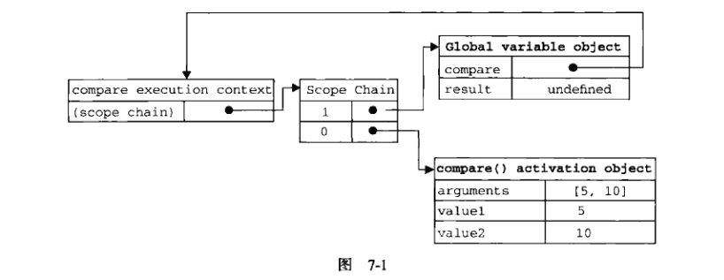

#前言
定义函数的方式有两种：一种是函数声明，另一种就是函数表达式。<br>
1.函数声明的语法：<br>
    `function functionName(agr0, arg1, arg2){ }`<br>

* `Firefox`、`Safari`、`Chrome`、`Opera`都给函数定义了一个非标准的`name`属性，这个属性可以访问到给函数指定的名字。<br>
    `console.log(functionName.name);    //functionName`<br>
* **函数声明提升：** 在执行代码之前会先读取函数声明。这就意味着可以把函数声明放在调用它的语句后面。

2.使用函数表达式创建函数：函数表达式有几种不同的语法形式。最常见的一种是：<br>
    `var functionName = function(arg0, arg1, arg2){ };`<br>

* 这种情况创建的函数叫做**匿名函数** ，因为`function`关键字后面没有标识符。匿名函数的`name`属性时空字符串。
* 函数表达式与其他表达式一样，在使用前必须先赋值。
```    
    sayHi();    //错误：函数还不存在
    var sayHi = function(){
        alert("hi");
    }
```
**理解函数提升的关键，就是理解函数声明与函数表达式之间的关系。**<br>
```
    //不要这样做
    if（condition）{
        function sayHi(){
            alert("hi");
        }
    }else{
        function sayHi(){
            alert("Yo");
        }
    }
```
表面上看，以上代码在condition为true时，使用一个sayHi()的定义，否则用另一个。实际上，这在ECMAScript中属于无效语法，JavaScript引擎会尝试修正错误，将其转换为合理的状态。但问题是是浏览器尝试修正错误的语法并不一致。大多数浏览器会返回第二个声明；Firefox会在condition为true时返回第一个声明。因此，不应该出现这样的代码。
```
    //可以这样做
    var sayHi;
    if（condition）{
        sayHi = function(){
            alert("hi");
        }
    }else{
        sayHi = function(){
            alert("Yo");
        }
    }
```
上面这个例子没有问题，不同的函数会根据condition被赋值给syaHi。

# 7.1 递归
用`arguments.callee`代替函数体内对函数名的引用
```
    function factorial(num){
        if(num<=1){
            return 1;
        }else{
            //return num*factorial(num-1);
            return num*arguments.callee(num-1);
        }
    }
```
    但在严格模式下，不能通过脚本访问`arguments.callee`，访问这个属性会导致错误。可以使用命名函数表达式来达到相同的结果。
```
    var factorial = (function f(num){
        if(num<=1){
            return 1;
        }else{
            return num*f(num-1);
        }
    });
```
# 7.2 闭包
&emsp;&emsp;**闭包**是指有权访问另一个函数作用域中的变量的函数。创建闭包的常见方式，就是在一个函数内部创建另一个函数。<br>
&emsp;&emsp;如何创建作用域链以及作用域链有什么作用的细节，对彻底理解闭包至关重要。当某个函数第一次被调用时，会创建一个执行环境及相应的作用域了，并把作用域链赋值给某一个特殊的内部属性（即\[\[Scope\]\]）。然后，使用`this`、`arguments`、和其他命名参数的值来初始化函数的活动对象。在但作用域链中，外部函数的活动对象始终处于第二位，外部函数的外部函数的活动对象处于第三位，......直至为作用域链终点的全局执行环境。
```
    function compare(value1, value2){
        if(value1 < value2){
            return -1;
        }else if(value1 > value2){
            return 1;
        }else{
            return 0;
        }
    }
    var result = compare(5, 10);
```
当第一次调用compare()时，会创建一个包含`this`、`arguments`、`value1`、`value2`的活动对象。全局执行环境的变量对象（包含`this`、`result`和`compare`）在compare()执行环境的作用域链中则处于第二位。图7-1展示了包含上述关系的compare()函数执行时的作用域链。
<br>
&emsp;&emsp;后台的每个执行环境都有一个表示变量的对象——变量对象。全局环境的变量对象始终存在，而像compare()函数这样的局部环境的变量对象，则只在函数执行的过程中存在。在创建compare()函数时，会创建一个预先包含全局变量对象的作用域链，这个作用域链被保存在内部的\[\[Scope\]\]属性中。当调用compare()函数时，会为函数创建一个执行环境，然后通过复制函数的\[\[Scope\]\]属性中的对象构建起执行环境的作用域链。此后，又有一个活动对象（在此作为变量对象使用）被创建并被推入执行环境作用域链的前端。compare()作用域链中包含两个变量对象：本地活动对象和全局变量对象。
```
    function createComparisonFunction(prorotypeName){
        return function(object1, object2){
            ////////////////////////////////////////
            var value1 = object1[prototypeName];
            var value2 = object2[prototypeName];
            ////////////////////////////////////////
            if(value1 < value2){
                return -1;
            }else if(value1 > value2){
                return 1;
            }else{
                return 0;
            }
        };
    }
```
在这个例子中，value1和value2是内部函数中的代码，这两行代码访问了外部函数中的变量`prototypeName`。即使这个内部函数被返回了，而且是在其他地方被调用了，但它仍然可以访问变量`prototypeName`。之所以还能够访问这个变量，是因为内部函数的作用域链中包含createComparisonFunction()的作用域。<br>
在另一个函数内部定义的函数会将包含函数（即外部函数）的活动对象添加到它的作用域链中。因此，在createComparisonFunction()函数内部定义的匿名函数的作用域链中，实际上将会包含外部函数createComparisonFunction()的活动对象。
```
    var compare = createComparisonFunction("name");
    var result = compare({name: "Nicholas"},{name: "Greg"});
```
在匿名函数从createComparisonFunction()中被返回后，它的作用域链被初始化为包含createComparisonFunction()函数的活动对象和全局变量对象。这样，匿名函数就可以访问在createComparisonFunction()中定义的所有变量。更为重要的是，createComparisonFunction()函数在执行完毕后，其活动对象也不会被销毁，因为匿名函数的作用域链仍然在引用这个活动对象。换句话说，当createComparisonFunction()函数返回后，其执行环境的*作用域链* 会被销毁，但它的*活动对象* 仍然会保留在内存中；直到匿名函数被销毁后，createComparisonFunction()的活动对象才会被销毁。例如：
```
    //创建函数
    var compareNams = createComparisonFunction("name");
    //调用函数
    var result = compareNames({name: "Nicholas"},{name: "Greg"});
    //解除对匿名函数的引用（以便释放内存）
    compareName = null;
```
图7-2展示了调用compareNames()的过程中产生的作用域链之间的关系。

**建议：** 由于闭包会携带包含它的函数的作用域，因此会比其他函数占用更多的内存。过度使用闭包可能会导致内存占用过多，建议只在绝对必要时再考虑使用闭包。
## 7.2.1 闭包与变量
闭包只能取得包含函数中任何变量的最后一个值。因为闭包所保存的是整个变量对象，而不是某个特殊的变量。
```
    function createFunctions(){
        var result = new Array();
        for(var i=0;i<10;i++){
            result[i] = function(){
                return i;
            }
        }
        return result;
    }
```
以上代码每个函数中都返回10。createFunctions()函数返回后，变量i的值是10，此时每个函数都引用着保存变量i的同一个变量对象。
```
    function createFunctions(){
        var result = new Array();
        for(var i=0;i<10;i++){
            result[i] = function(num){
                return function(){
                    return num;
                }
            }(i);
        }
        return result;
    }
```
以上代码能够符合预期，由于函数参数是按值传递的，所以就会将变量i的当前值复制给参数num。
## 7.2.2 关于this对象
在闭包中使用`this`对象也可能会导致一些问题。匿名函数的执行环境具有全局性，因此其`this`对象通常指向`window`。由于编写闭包的方式不同，这一点可能不会那么明显。
```
    var name = "The Window";
    var object = {
        name : "My Object";
        getNameFunc : function(){
            return function(){
                return this.name;
            }
        }
    };
    alert(object.getNameFunc()());  //"The Winodw"（在非严格模式下）
```
每个函数在被调用时，其活动对象都会自动取得两个特殊变量：`this`和`arguments`。内部函数在搜索这两个变量时，只会搜索到其活动对象为止，因此永远不可能直接访问外部函数中的这两个变量。不过，把外部作用域中的`this`对象保存在一个闭包能够访问到的变量里，就可以让闭包访问该对象了。
```
    var name = "The Window";
    var object = {
        name : "My Object";
        getNameFunc : function(){
            ////////////////////////////
            var that = this;
            return function(){
                return that.name;
            }
            ///////////////////////////
        }
    };
    alert(object.getNameFunc()());  //"My Object"
```
`this`和`arguments`也存在同样的问题。如果想访问作用域中的`arguments`对象，必须将该对象的引用保存到另一个闭包能够访问的变量中。
## 7.2.3 内存泄漏
由于IE9之前的版本使用了引用计数的垃圾回收方式，因此闭包在IE的这些版本中会导致一些特殊的问题。
```
    function assignHandler(){
        var element = document.getElementById("someElement");
        element.onclick = function(){
            alert(element.id);
        }
    }
```
以上代码创建了一个作为element元素事件处理程序的闭包，而这个闭包则有创建一个循环引用。只要匿名函数存在，element的引用数至少是1，因此它所占用的内存就永远不会被回收。改写代码可以解决这个问题。
```
    function assignHandler(){
        var element = document.getElementById("someElement");
        var id = element.id;
        element.onclick = function(){
            alert(id);
        }
        element = null;
    }
```
通过把element.id的一个副本保存在一个变量中，并且在闭包中引用该变量消除循环引用。但仅仅做到这一步还是不能解决内存泄漏的问题。必须要记住：闭包会引用包含函数的整个活动对象，而其中包含着element。即使闭包不直接引用element，包含函数的活动对象中也仍然保存一个引用。因此，有必要把element变量设置为null。这样就能够解除对DOM对象的引用，顺利地减少其引用次数，确保正常回收其占用的内存。
# 7.3 模仿块级作用域
`JavaScript`没有块级作用域的概念。这意味着在块语句中定义的变量，实际上是在包含函数中而非语句中创建的。
```
    function outputNumbers(count){
        for(var i=0;i<count;i++){
            alert(i);
        }
        alert(i);   // 计数
    }
```
匿名函数可以用来模仿块级作用域并避免这个问题。<br>
用作块级作用域（通常称为私有作用域）的匿名函数逇衣服啊如下所示。
```
    //正确
    (function(){
        //这里是块级作用域
    })();
    //出错
    function(){
        //这里是块级作用域
    }();    //出错
```
`JavaScript`将`function`关键字当作一个函数声明的开始，而 *函数声明* 后面不能跟圆括号。*函数表达式* 后面可以跟圆括号。<br>
无论在什么地方，只要临时需要一些变量，就可以使用私有作用域
```
    function outputNumbers(count){
        (function(){
            for(var i=0;i<count;i++){
                alert(i);
            }
        })();
        alert(i);   // error
    }
```
这种技术经常在全局作用域中被用在函数外部，从而限制向全局作用域中添加过多的变量和函数。我们应该尽量减少向全局作用域中添加变量和函数。在一个由多人开发的大型应用中，过多的全局变量和函数很容易导致命名冲突。
# 7.4 私有变量
严格来讲，`JavScript`中没有私有成员的概念；所有对象属性都是公有的。不过，倒是有一个私有变量的概念。任何在函数中定义的变量，都可以认为是私有变量，因为不能再函数的外部访问这些变量。私有变量包括 *函数的参数*、 *局部变量*和 *在函数内部定义的其他函数*。<br>
我们把有权访问私有变量和私有函数的公有方法称为 **特权方法** 。有两种在对象上创建特权方法的方式。<br>
第一种是在构造函数中定义特权方法。<br>
```
    function MyObject(){
        //私有变量和私有函数
        var privateVariable = 10;
        function privateFunction(){
            return false;
        }
        //特权方法
        this.publicMethod = function(){
            privateVariable ++;
            return privateFunction();
        };
    }
``` 
对这个例子而言，变量privateVariable和函数privateFunction()只能通过特权方法publicMethod()来访问。除此之外，没有任何办法可以直接访问变量privateVariable和函数privateFunction()。
利用私有和特权成员，可以隐藏那些不应该被直接修改的数据，例如：
```
    function Person(name){
        this.getName = functon(){
            return name;
        };
        this.setName = function(value){
            name = value;
        };
    }
    var person = new Person("Nicholas");
    alert(person.getName());    //"Nicholas"
    person.setName("Greg");
    alert(person.getName());    //"Greg"
```
构造函数模式的缺点是针对每个实例都会创建同样一组新方法，而使用静态私有变量来实现特权方法就可以避免这个问题。

## 7.4.1 静态私有变量
```
    (function(){
        var name = "";
        Person = function(value){
            name = value;
        };
        Person.prototype.getName = function(){
            return name;
        };
        Person.prototype.setName = function(value){
            name = value;
        };
    })();
    var person1 = new Person("Nicholas");
    alert(person1.getName());   //"Nicholas"
    person1.setName("Greg");
    alert(person1.getName());   //"Greg"

    var person2 = new Person("Michael");
    alert(person1.getName());   //Michael
    alert(person2.getName());   //Michael
```
这个函数与在构造函数中定义特权方法的主要区别，就在于私有变量和函数是由实例共享的。<br>
以这种方式创建静态私有变量会因为使用原型而增加代码复用，但每个实例都没有自己的私有变量。到底使用实例变量还是静态私有变量，应该视具体需求而定。<br
多查找作用域链中的一个层次，就会在一定程度上影响查找速度。而正正是使用闭包和私有变量的一个明显的不足之处。

## 7.4.2 模块模式
模块模式是为单例创建私有变量和特权方法。所谓单例，指的就是只有一个实例的对象。
```
    var application = function(){
        //私有变量和函数
        var components = new Array();
        //初始化
        components.push(new BaseComponent());
        //公共
        return {
            getComponentCount : function(){
                return components.length;
            },
            registerComponent : function(component){
                if(typeof component == "object"){
                    components.push(component);
                }
            }
        };
    }();
```
简言之，如果必须创建一个对象并以某些数据对其进行初始化，同时还有公开一些能够访问这些私有数据的方法，那么就可以使用模块模式。以这种模式创建的每个单例都是`Objcet`的实例，因为最终要通过一个对象字面量来表示它。
## 7.4.3 增强的模块模式
增强的模块模式适合那些单例必须是某种类型的实例，同时还必须添加某些属性和（或）方法对其加以增强的情况。<br>
例如，模块模式的例子中的application对象必须是BaseComponent的实例，那么可以使用以下代码。
```
    var application = function(){
        //私有变量和函数
        var components = new Array();
        //初始化
        components.push(new BaseComponent());
        //创建application的一个局部副本
        var app = new BaseComponent();
        //公共
        app.getComponentCount = function(){
            return components.length;
        };
        app.registerComponent = function(component){
            if(typeof component == "object"){
                components.push(component);
            }
        }
        //返回这个副本
        return app;
    }();
```
主要的不同之处在于命名变量app的创建过程，因为它必须是`BaseComponent`的实例。
# 7.5  小结
&emsp;&emsp;在`JavaScript`编程中，函数表达式是一种非常有用的技术。使用函数表达式可以无须对函数命名，从而实现动态编程。匿名函数，也称为拉姆达函数，是一种使用`JavaScript`函数的强大方式。以下总结了函数表达式的特点：<br>

* 函数表达式不同于函数声明。函数声明要求有名字但函数表达式不需要。没有名字的函数表达式也叫做匿名函数。
* 递归函数应该始终是要`arguments.callee`来递归地调用自身。

&emsp;&emsp;当在函数内部定义了其他函数时，就创建了闭包。闭包有权访问包含函数内部的所有变量。<br>
使用闭包可以在`JavaScript`中模仿块级作用域，要点如下：

* 创建并立即调用一个函数，这样既可以执行其中的代码，又不会在内存中留下对该函数逇引用。
* 结果就是函数内部的所有变量都会被立即销毁——除非将某些变量赋值给了包含作用域中的变量。

&emsp;&emsp;闭包还可以用于在对象中创建私有变量，相关概念和要点如下：<br>

* 即使`JavaScript`中没有正式的私有对象属性的概念，但可以使用闭包来实现公有方法，而通过公有方法可以访问在包含作用域中定义的变量。

&emsp;&emsp;`JavaScript`中的函数表达式和闭包都是及其有用的特性，利用它们可以实现很多功能。不过，因为创建闭包需要维护额外的作用域，所以过度使用它们可能会占用大量内存。
