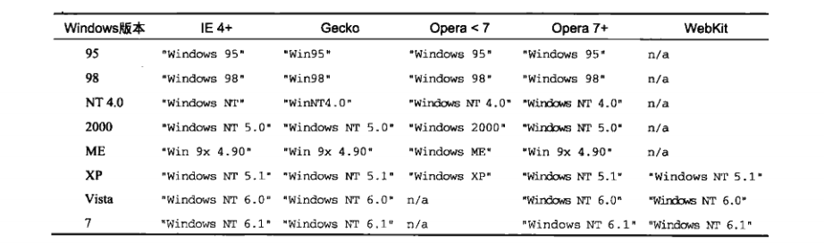

# 前言
检测Web客户端的手段很多，而且各有利弊。但最重要的还是要知道，不到万不得已，就不要使用客户端检测。只要能找到更通用的方法，就应该优先采用更通用的方法。一言以蔽之，先设计最通用的方案，然后再使用特定于浏览器的技术增强该方案。

# 9.1 能力检测
最常用也最为人们广泛接受的客户端检测形式是 **能力检测（又称特性检测）** 。能力检测的模板不是识别特定的浏览器，而是识别浏览器的能力。能力检测的基本模式如下：
```
    if(object.propertyInQuestion){
        //使用object.propertyInQuestion
    }
```
要理解能力检测，首先必须理解两个重要的概念。第一个概念就是先检测达成目的的最常用的特性，这样可以保证代码最优化，在多数情况下都可以避免测试多个条件。<br>
第二个重要的概念就是必须测试实际要用到的特性。一个特性存在，不一定意味着另一个特性也存在。
```
    function getWindowWidth(){
        if(document.all){   //假设是IE
            return document.documentElement.clientWidth;    //错误的用法
        }else{
            return window.innerWidth;
        }
    }
```
以上代码的问题在于，document.all存在也不一定表示浏览器就是IE。实际上也可能是Opera；Opera支持document.all，也支持window.innerWidth。

## 9.1.1 更可靠的能力检测
能力检测对于想知道某个特性是否会按照适当方式行事非常有用，但这样还是不知道该成员是不是自己想要的。
```
    //不要这样做！这不是能力检测。只检测了是否存在相应的方法
    function isSortable(object){
        return !!object.sort;
    }
```
以上代码试图通过检测对象是否存在`sort()`方法来确定对象是否支持排序。问题是，任何包含sort属性的对象也会返回`true`。<br>
检测某个属性是否存在并不能确定对象是否支持排序。**更好的方式是检测sort是不是一个函数。**
```
    //这样更好：检查sort是不是函数
    function isSortable(object){
        return typeof object.sort == "function";
    }
```
在可能的情况下，**要尽量使用`typeof`进行能力检测。**<br>
在用`typeof`检测document.createElement()时，大多数浏览器都返回true，但在IE8及之前版本总不行。因为typeof document.createElement返回的是"object"，而不是"function"。如前所述，DOM对象是宿主对象，IE及更早版本中的宿主对象是通过COM而非JScript实现的。因此，document.createElement()函数确实是一个COM对象，所以返回"object"。<br>
`ActiveX`对象（只有IE支持）与其他对象的行为差异很大。
```
    //在IE中会导致报错
    var xhr = new ActiveXObject("Microsoft.XMLHttp");
    if(xhr.open){   //这里会发生错误
        //执行操作
    }
```
像这样直接把函数作为属性访问会导致错误。使用`typeof`操作符会更靠谱一点，但IE对`typeof xhr.open`会返回"unkonwn"。<br>
在浏览器环境下测试任何对象的某个特性是否存在，要使用下面这个函数。
```
    function isHostMethod(object, property){
        var t = typeof object[property];
        return t=="function" || (!!(t=="object" && object[prototype])) || t=="unknown";
    }
    result = isHostMethod(xhr, "open");     //true
    result = isHostMethod(xhr, "foo");     //false
```

## 9.1.2 能力检测不是浏览器检测
检测几个或某几个特性并不能够确定浏览器。
```
    //错误！还不够具体
    var isFirefox = !!(navigator.vendor && navigator.vendorSub);
    //错误！假设过头了
    var isIE = !!(document.all && document.uniqueID);
```
这两行代码代表了对能力检测的典型无用。以前，确实可以通过检测navigator.vendor和 navigator.vendorSub来确定Firefox浏览器。但是，Safari也依葫芦画瓢地实现了相同的属性。于是这段带，就会导致人们做出错误的判断。为了检测IE，使用document.all和document.uniqueID。这就相当于假设IE将来的版本中仍然会继续存在着两个属性，同时还假设其他浏览器都不会实现这两个属性。<br>
实际上，根据浏览器不同，将能力检测组合起来是更可取的方式。如果知道自己的应用程序需要使用某些特定的浏览器特性，那么最好是一次性检测所有相关特性，而不是分别检测。
```
    //确定浏览器是否支持Netscape风格的插件
    var hasNSPlugins = !!(navigator.plugins && navigator.plugins.length);
    //确定浏览器是否具有DOM1级规定的能力
    var hasDOM1 = !!(document.getElementById && document.createElement && document.getElementByTagName);
```
在实际开发中，应该将能力检测作为确定下一步解决方案的依据，而不是用它来判断用户使用的是什么浏览器。

# 9.2 怪癖检测
怪癖检测的目标是识别浏览器的特殊行为。

* IE8及更早版本中，如果某个实例属性与标记为\[\[DontEnum\]\]的某个原型属性同名，那么该实例属性将不会出现在`for-in`循环当中。可以使用如下代码来检测这种怪癖。
```
    var hasDontEnumQuirk = function(){
        var o = {toStrin : function(){}};
        for (var prop in o){
            if(prop == "toString"){
                return false;
            }
        }
        return true;
    }();
```
* 另一个经常需要检测的是Safari3以前版本会枚举被隐藏的属性。可以用下面的函数来检测。
```
    var hasEnumShadowsQuirk = function(){
        var o = { toStrin : function(){} };
        var count = 0;
        for (var prop in o){
            if(prop == "toString"){
                count ++;
            }
        }
        return (count > 1);
    }
```
一般来说，怪癖都是个别浏览器所独有的。在相关浏览器的新版本中，这些问题可能会也可能不会被修复。由于检测怪癖设计运行代码，因此 **建议** 检测那些对你有直接影响的怪癖，而且最后在脚本一开始就只想此类检测，以便尽早解决问题。

# 9.3 用户代理检测
这是争议最大的一种客户端检测技术。用户代理检测通过检测用户代理字符串来确定实际使用的浏览器。在每次HTTP请求过程中，用户代理字符串时作为响应首部发送的，而且该字符串可以通过JavaScript的navigator.useAgent属性访问。*在服务器端* ，通过检测用户代理字符串来确定用户使用的浏览器是一种常见而且广为接受的做法。而 *在客户端* ，用户代理检测仪表被当作一种万不得已才用的做法，其优先级排在 *能力检测和怪癖检测之后* 。它们的争议在于电子欺骗。电子欺骗就是指浏览器通过在自己的用户代理字符串假如一些错误或误导性信息，来达到欺骗服务器的目的。
## 9.3.1 用户代理字符串的历史
## 9.3.2 用户代理字符串检测技术
考虑到历史原因以及现代浏览器中用户代理字符串的使用方式，通过用户代理字符串来检测特定的浏览器并不是一件轻松的事。因此，要确定的往往是你需要多么具体的浏览器信息。一般情况下，知道 **呈现引擎** 和 **最低限度的版本** 就足以决定正确的操作方法了。

* 不推荐使用下列代码。因为它要依据具体的版本来决定。只要有新的IE版本，就必须更新这些代码。
```
    if (isIE6 || isIE7){
        //代码
    }
```
* 推荐使用相对版本号来解决上面的问题。
```
    if(ieVer >= 6){
        //代码
    }
```

1. 我们编写的脚本将主要检测五大程序引擎：IE、Gecko、WebKit、KHTML和Opera。<br>
为了不在全局作用域中添加多余的变量，我们将使用模块增强模式来封装检测脚本。
```
    var client = function(){
        var engine = {
            //呈现引擎
            ie: 0,
            gecko: 0,
            webkit: 0,
            khtml: 0,
            opera: 0,
            //具体的版本号
            ver: null
        };
        //在此检测呈现引擎、平台和设备
        return {
            engine: engine
        };
    }();
```
检测到哪个呈现引擎，就以浮点数值形式将该引擎的版本号写入相应的属性。而呈现引擎的完整版本（是一个字符串），则被写入ver属性。做这样的区分可以支持像下面这样编写代码：
```
    if(client.engine.ie){   //如果是IE，client.ie的值应该大于0
        //针对IE的代码
    }else if(client.engine.gecko > 1.5){
        if(cliennt.engine.ver == "1.8.1"){
            //针对这个版本执行某些操作
        }
    }
```
要正确地识别呈现引擎，关键是检测顺序要正确。由于用户代理字符串存在诸多不一致的地方，如果检测顺序不对，很可能会导致检测结果不正确。为此，**第一步** 就是识别Opera，因为它的用户代理字符串有可能完全模仿其他浏览器。
```
    if(window.opera){
        engine.ver = window.opera.version();
        engine.opera = parseFloat(engine.ver);
    }
```
应该放在 **第二位** 检测的程序引擎是WebKit。因为WebKit的用户代理字符串包含"Gecko"和"KHTML"这两个子字符串。
```
    var ua = navigator.userAgent;
    if(window.opera){
        engine.ver = window.opera.version();
        engine.opera = parseFloat(engine.ver);
    }else if(/AppleWebKit\/(\S+)/.test(ua)){
        engine.ver = RegExp["$1"];
        engine.webkit = parseFloat(engine.ver);
    }
```
**第三个** 要测试的呈现引擎是KHTML。同样，KHTML的用户代理字符串中也包含"Gecko"，因此，在排除KHTML之前，我们无法准确检测基于Gecko的浏览器。
```
    var ua = navigator.userAgent;
    if(window.opera){
        engine.ver = window.opera.version();
        engine.opera = parseFloat(engine.ver);
    }else if(/AppleWebKit\/(\S+)/.test(ua)){
        engine.ver = RegExp["$1"];
        engine.webkit = parseFloat(engine.ver);
    }else if(/KHTML\/(\S+)/.test(ua) || /Konqueror\/([^;]+)/.test(ua)){
        engine.ver = RegExp["$1"];
        engine.khtml = parseFloat(engine.ver);
    }
```
在排除WebKit和KHTML之后，**第四个** 要检测的就是Gecko。
```
    var ua = navigator.userAgent;
    if(window.opera){
        engine.ver = window.opera.version();
        engine.opera = parseFloat(engine.ver);
    }else if(/AppleWebKit\/(\S+)/.test(ua)){
        engine.ver = RegExp["$1"];
        engine.webkit = parseFloat(engine.ver);
    }else if(/KHTML\/(\S+)/.test(ua) || /Konqueror\/([^;]+)/.test(ua)){
        engine.ver = RegExp["$1"];
        engine.khtml = parseFloat(engine.ver);
    }else if(/rv:([^\)]+)\) Gecko\/\d{8}/.test(ua)){
        engine.ver = RegExp["$1"];
        engine.gecko = parseFloat(engine.ver);
    }
```
**最后一个** 要检测的呈现引擎就是IE了。
```
    var ua = navigator.userAgent;
    if(window.opera){
        engine.ver = window.opera.version();
        engine.opera = parseFloat(engine.ver);
    }else if(/AppleWebKit\/(\S+)/.test(ua)){
        //实际的版本号可能会包含数字、小数点和字母，所以捕获组使用了表示非空格的特殊字符(\S)。
        engine.ver = RegExp["$1"];
        engine.webkit = parseFloat(engine.ver);
    }else if(/KHTML\/(\S+)/.test(ua) || /Konqueror\/([^;]+)/.test(ua)){
        //Konqueror后跟一个斜杠，再后跟不包含分号的所有字符
        engine.ver = RegExp["$1"];
        engine.khtml = parseFloat(engine.ver);
    }else if(/rv:([^\)]+)\) Gecko\/\d{8}/.test(ua)){    
        //Gecko的版本号位于字符串"rv:"与一个闭括号之间，因此要查找所有不是闭括号的字符，还要查找字符串"Gecko/"后跟8个数字
        engine.ver = RegExp["$1"];
        engine.gecko = parseFloat(engine.ver);
    }else if(/MSIE ([^;]+)/.test(ua)){
        engine.ver = RegExp["$1"];
        engine.ie = parseFloat(engine.ver);
    }
```

2. 识别浏览器<br>
为client对象再添加一些新的属性。
```
    var client = function(){
        var engine = {
            //呈现引擎
            ie: 0,
            gecko: 0,
            webkit: 0,
            khtml: 0,
            opera: 0,
            //具体的版本号
            ver: null
        };
        var browser = {
            //浏览器
            ie: 0,
            firefox: 0,
            safari: 0,
            konq: 0,
            opera: 0,
            chrome: 0,
            //具体的版本
            ver: null
        };
        //在此检测呈现引擎、平台和设备
        return {
            engine: engine,
            browser: browser
        };
    }();
```
由于大多数浏览器与其呈现引擎密切相关，所以下面示例中检测浏览器的代码与检测呈现引擎的代码是混合在一起的。
```
    //检查呈现引擎及浏览器
    var ua = navigator.userAgent;
    if(window.opera){
        engine.ver = browser.ver = window.opera.version();
        engine.opera = browser.opera = parseFloat(engine.ver);
    }else if(/AppleWebKit\/(\S+)/.test(ua)){
        //实际的版本号可能会包含数字、小数点和字母，所以捕获组使用了表示非空格的特殊字符(\S)。

        engine.ver = RegExp["$1"];
        engine.webkit = parseFloat(engine.ver);

        //确定是Chrome还是Safari
        if(/Chrome\/(\S+)/.test(ua)){
            browser.ver = RegExp["$1"];
            browser.chrome = parseFloat(browser.ver);
        }else if(/Version\/(\S+)/.test(ua)){
            browser.ver = RegExp["$1"];
            browser.safari = parseFloat(browser.ver);
        }else{
            //近似地确定版本号
            var safariVersion = 1;
            if(engine.webkit < 100){
                safariVersion = 1;
            }else if(engine.webkit < 312){
                safariVersion = 1.2;
            }else if(engine.wenkit < 412){
                safariVersion = 1.3;
            }else{
                safariVersion = 2;
            }
            browser.safari = browser.ver = safariVersion;
        }
    }else if(/KHTML\/(\S+)/.test(ua) || /Konqueror\/([^;]+)/.test(ua)){
        //Konqueror后跟一个斜杠，再后跟不包含分号的所有字符

        engine.ver = browser.ver = RegExp["$1"];
        engine.khtml = browser.konq = parseFloat(engine.ver);
    }else if(/rv:([^\)]+)\) Gecko\/\d{8}/.test(ua)){    
        //Gecko的版本号位于字符串"rv:"与一个闭括号之间，因此要查找所有不是闭括号的字符，还要查找字符串"Gecko/"后跟8个数字

        engine.ver = RegExp["$1"];
        engine.gecko = parseFloat(engine.ver);

        //确定是不是火狐
        if(/Firefox\/(\S+)/.test(ua)){
            browser.ver = RegExp["$1"];
            browser.firefox = parseFloat(browser.ver);
        }
    }else if(/MSIE ([^;]+)/.test(ua)){
        engine.ver = browser.ver = RegExp["$1"];
        engine.ie = browser.ie = parseFloat(engine.ver);
    }
```

3. 识别平台<br>
那些具有各种平台版本的浏览器（如Safari、Firefox和Opera）在不同的平台下可能会有不同的问题。目前的三大主流平台是Windows、Mac进而Unix（包括各种Linux）。为了检测这些平台，还需要像下面这样再添加一个新对象。
```
    var client = function(){
        var engine = {
            //呈现引擎
            ie: 0,
            gecko: 0,
            webkit: 0,
            khtml: 0,
            opera: 0,
            //具体的版本号
            ver: null
        };
        var browser = {
            //浏览器
            ie: 0,
            firefox: 0,
            safari: 0,
            konq: 0,
            opera: 0,
            chrome: 0,
            //具体的版本
            ver: null
        };
        var system = {
            win: false,
            mac: false,
            x11: false
        };
        //在此检测呈现引擎、平台和设备
        return {
            engine: engine,
            browser: browser,
            system: system
        };
    }();
```
在确定平台是，用`navagator.platform`属性，可能的值包括"Win32"、"Win64"、"MacPPC"、"MacIntel"、"Xll"和"Linux i686"，这些值在不同的浏览器中都是一致的。
```
    var p = navigator.platform;
    system.win = p.indexOf("Win") == 0;
    system.mac = p.indexOf("Mac") == 0;
    system.xll = (p.indexOf("xll") == 0) || (p.indexOf("Linux") == 0);
```

4. 识别Windows操作系统<br>
在Windows平台下，还可以从用户代理字符串中进一步取得具体的操作系统信息。下表列出了不同浏览器在表示不同的Windows操作系统时给出的不同字符串。

```
    if(system.win){
        if(/Win(?:dows )?([^do]{2})\s?(\d+\.\d+)?/.test(ua)){
            if(RegExp["$1"] == "NT"){
                system.win = RegExp["$2"];
            }
        }
    }
```
有了这些检查平台的代码后，我们可以编写如下代码。
```
    if(client.system.win){
        if(client.system.win == "10.0"){
            //说明这是win10
        }
    }
```

5. 识别移动设备
为要检测的所有移动设添加属性。
```
    var client = function(){
        var engine = {
            //呈现引擎
            ie: 0,
            gecko: 0,
            webkit: 0,
            khtml: 0,
            opera: 0,
            //具体的版本号
            ver: null
        };
        var browser = {
            //浏览器
            ie: 0,
            firefox: 0,
            safari: 0,
            konq: 0,
            opera: 0,
            chrome: 0,
            //具体的版本
            ver: null
        };
        var system = {
            win: false,
            mac: false,
            x11: false,

            //移动设备
            iphone: false,
            ipod: false,
            ipad: false,
            ios: false,
            android: false,
            nokiaN: false,
            winMobile: false
        };
        //在此检测呈现引擎、平台和设备
        return {
            engine: engine,
            browser: browser,
            system: system
        };
    }();
```
通常简单地检测字符串"iPhone"、"iPod"、"iPad"，就可以分别设置相应属性的值了。
```
    system.iphone = ua.indexOf("iPhone") > -1;
    system.ipod = ua.indexOf("ipod") > -1;
    system.ipad = ua.indexOf("iPad") > -1;
```

6. 识别游戏系统

## 9.3.3 使用方法
用户代理检测是客户端检测的最后一个选择。只要可能，都应该优先采用能检测和怪癖检测。用户代理检测一般适用于下列情形。

* 不能直接准确地使用能力检测或怪癖检测。例如，某些浏览器实现了为将来功能预留的存根(stub)函数。在这种情况下，仅测试相应的函数是否存在还得不到足够的信息。
* 同一款浏览器在不同平台下具备不同的能力。这时候，可能就有必要确定浏览器位于哪个平台下。
* 为了跟踪分析等目的需要知道确切的浏览器。