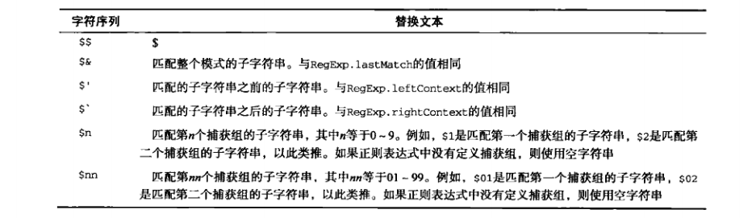
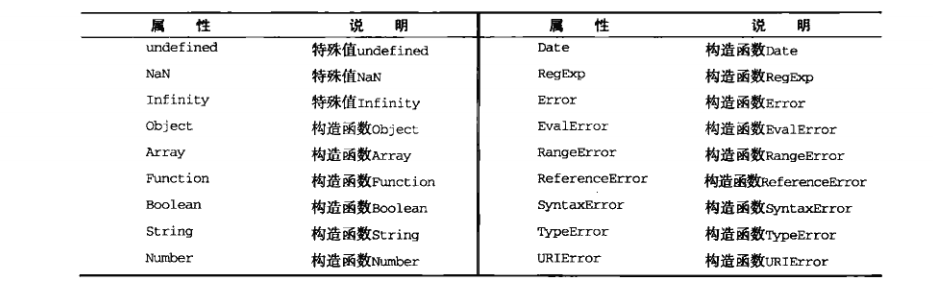
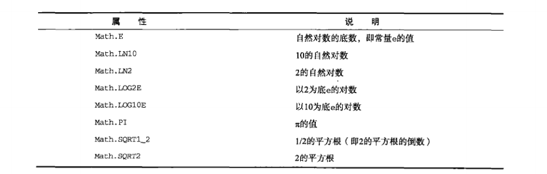
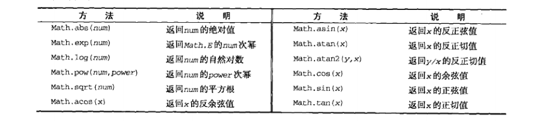

# 前言
>&emsp;&emsp;引用类型的值（对象）是**引用类型**的一个实例。引用类型是一种数据结构，用于将数据和功能组织在一起。`ECMAScript`从技术上讲是一门面向对象的语言，但它不具备传统的面向对象语言所支持的类和接口等基本结构。引用类型有时候也被称为**对象定义**，因为它们描述的是一类对象所具有的属性和方法。

`var person = new Object();` 
这行代码创建了Object引用类型的一个新实例。使用的*构造函数*是Object，它只为新对象定义了默认的属性和方法。

# 5.1 Object类型
1. 创建Object实例的方式有两种。
    * 使用new操作符后跟`Object`构造函数
    <pre><code>
        var person = new Object();
        person.name = "Nicholas";
        person.age = 29;
    </code></pre>
    * 使用对象字面量表示法（实际上不会调用Object构造函数）
    <pre><code>
        var person = {
            name : "Nicholas",
            age : 29
            //属性名可用字符串表示，也可以不用
            //"name" : "Nicholas"
        }
        //也可以留空花括号
        var person = {};    //与 new Object()相同
        person.name = "Nicholas";
        person.age = 29;
    </code></pre>
2. 访问对象属性的方法有两种
    * 点表示法
    * 方括号表示法
    <pre><code>
        console.log(person.name);
        console.log(person["name"]);
    </code></pre>
方括号语法的优点是可以通过变量来访问属性；如果属性名中包含会导致语法错误的字符，或者属性名使用的是关键字或保留字，也可以用方括号。
<pre><code>
    //变量属性
    var propertyName = "name";
    console.log(person[propertyName]);  //Nicholas
    //会导致错误语法的字符
    person["first name"] = "Nicholas";
</code></pre>
**建议：** 除非必须使用变量来访问属性，否则建议使用点表示法。

# 5.2 Array类型
1. 创建数组的基本方式有两种
    * 使用Array构造函数
    <pre><code>
        var colors = new Array();
        var colors = new Array(20);     //创建length为20的数组
        var colors = new Array("red","blue","green");   //创建包含3个字符串的数组
        var colors = Array(2);  //可以省略new关键字
    </code></pre>
    * 使用数组字面量表示法（不会调用Array构造函数）
    <pre><code>
        var colors = ["red","blue","green"];
        var values = [1,2,];    //不要这样！这样会创建一个包含2或3项的数组
        var options = [,,,,,];  //不要这样！这样会创建一个包含5或6项的数组
    </code></pre>
    **！注意：** 在IE中，values会成为一个包含3个项目（最后一个为undefined）的数组；在其他浏览器中，values会成为一个包含2个项目的数组。options类似。**强烈建议不要使用这种语法**
2. 数组的`length`属性它不是只读的。通过设置这个属性，可以从数组的末尾移除项或向数组中添加新项。
    <pre><code>
        var colors = ["red","blue","green"];
        colors.length = 2;
        console.log(colors(2));     //undefined
        colors[length] = "orange";  //方便给数组添加新项
    </code></pre>
## 5.2.1 检测数组
对于*一个网页*或者*一个全局作用域*而言，使用`instanceof`足矣。如果网页中包含多个框架，那实际上就存在两个以上不同的全局执行环境，从而存在两个以上不同版本的`Array`构造函数。为解决这个问题，`ECMAScript 5`新增了`Array.isArray()`方法。这个方法用来确定某个值到底是不是数组，而不管它是在哪个全局执行环境中创建的。
<pre><code>
    if(Array.isArray(value)){
        //...
    }
</code></pre>
## 5.2.2 转换方法
* `toLocaleString()`
* `toString()`
* `valueOf()`
* `join()` 
如果数组中的某一项的值是`null`或者`undefined`，那么该值在以上4个方法返回的结果中以空字符串表示。
## 5.2.3 栈方法
* `push()`  返回数组的新长度
* `pop()`  返回移除的项
## 5.2.4 队列方法
* `shift()`     //返回移除的项
* `unshift()`   //返回数组的新长度 
`shift()`和`push()`结合使用；`unshift()`和`pop()`结合使用。 
**兼容性问题：** IE7及更早版本，`unshift()`方法总是返回`undefined`而不是数组的新长度。
## 5.2.5 重排序方法
1. `reverse()`：返回排序后的数组，会影响原数组
2. `sort()`：返回排序后的数组，会影响原数组
    * 默认情况下，`sort()`按升序排列数组项。`sort()`方法会调用每个数组项的`toString()`转型方法，然后比较得到的字符串。
    <pre><code>
        var values = [0,1,5,10,15];
        values.sort();
        alert(values);      //0,1,10,15,5
    </code></pre>
    *  `sort()`方法可以接收一个*比较函数*作为参数，以便我们指定哪个值位于哪个值的前面。比较函数通过返回一个小于零、等于零或大于零的值来影响排序结果。
## 5.2.6 操作方法
1. `concat()`：不影响原数组 
    `var colors2 = colors.concat("yellow",["black","brown"];`
2. `slice()`: 不影响原数组。基于当前数组创建一个新数组。接收一或两个参数，即要返回项的起始和结束位置，包含起始项，不包含结束项。 
    如果`slice()`方法的参数中有一个负数，则用数组长度加上该数来确定相应的位置。比如一个长度为5的数组上调用slice(-2,-1)与调用slice(3,4)得到的结果是一样的，如果结束位置小于起始位置，则返回空数组。
3. `splice()`：会影响原数组。返回数组中删除的项（没有删除元素则返回空数组） 
    `splice()`的3种用法： 
    * 删除：指定2个参数：要删除的第一项的位置和要删除的项数。
    * 插入：至少3个参数：起始位置、0（要删除的项数）和要插入的项。插入多项后面传第四、第五以至任意多个项。
    * 替换：至少3个参数：起始位置、要删除的项数和要插入的任意数量的项。
    <pre><code>
        var colors = ["red","green","blue"];
        var removed = colors.splice(0,1);
        alert(colors);      //green,blue
        alert(removed);     //red
        ///////////////////////////////////////////////
        removed = colors.splice(1,0,"yellow","orange");
        alert(colors);      //green,yellow,orange,blue
        alert(removed);     //空数组
        ///////////////////////////////////////////////
        removed = colors.splice(1,1,"red","purple");
        alert(colors);      //green,red,purple,orange,blue
        alert(removed);     //yellow
    </code></pre>
## 5.2.7 位置方法
* `indexOf()`
* `lastIndexOf()` 
这两个方法都接收两个参数：要查找的项和（可选）表示查找起点位置的索引。
## 5.2.8 迭代方法
>`ECMAScript 5`为数组定义了5个迭代方法。每个方法都接收2个参数：要在每一项上运行的函数和（可选）运行该函数的作用域对象——影响this的值。传入这些方法中的函数会接收3个参数：数组项的值、该项在数组中的位置和数组对象本身。

* `every()`：对数组中的每一项运行给定函数，如果该函数对每一项都返回`true`，则返回`true`。
* `fliter()`：对数组中的每一项运行给定函数，返回该函数会返回`true`的项组成的数组。
* `forEach()`：对数组中的每一项运行给定函数。这个方法没有返回值。
* `map()`：对数组中的每一项运行给定函数，返回每次函数调用的结果组成的数组。
* `some()`：对数组总的每一项运行给定函数，如果该函数对任一项返回`true`，则返回`true`。 
以上方法都不会修改数组中包含的值。
<pre><code>
    var numbers = [1,2,3,4,5,4,3,2,1];
    var everyResult = numbers.every(function(item,index,array){
        return (item>2);
    });
    //可以将every换成以上任一一个方法
</code></pre>
## 5.2.9 缩小方法
>&emsp;&emsp;`ECAScript 5`新增了两个缩小数组的方法：`reduce()`和`reduceRight()`。这两个方法都会迭代数组的所有项，然后构建一个最终返回的值。其中`reduce()`从数组的第一项开始，逐个遍历到最后。而`reduceRight()`则从数组的最后一项开始，向前遍历到第一项。 
&emsp;&emsp;这两个方法都接收2个参数：一个在每一项上调用的函数和（可选）作为缩小基础的初始值。传人这两个方法中的函数接收4个参数：前一个值、当前值、项的索引和数组对象。这个函数返回的任何值都会作为第一个参数自动传给下一项。第一次迭代发生在数组的第二项上，因此第一个参数是数组的第一项，第二个参数就是数组的第二项。

<pre><code>
    var values = [1,2,3,4,5];
    var sum = values.reduce(function(pre,cur,index,array){
        return pre + cur;
    });
    alert(sum);     //15
</code></pre>

# 5.3 Date类型
>`ECMAScript`中的`Date`类型是在早期Java中的`java.util.Date`类型基础上构建的。为此，`Date`类型使用自UTC(国际协调时间)1970年1月1日午夜（零时）开始经过的毫秒数来保存日期。在使用这种数据存储格式的条件下，`Date`类型保存的日期能够精确到1970年1月1日之前或之后的285616年。

1. 创建一个日期对象，使用new操作符和Date构造函数。 
    `var now = new Date();  // 自动获得当前日期和时间`
2. 创建一个特定日期和时间对象，必须传入表示该日期的毫秒数（即从UTC时间起值该日期止经过的毫秒数）。`ECMAScript`提供了两个方法简化这一计算过程。
    * `Date.parse()`
    * `Date.UTC()`
3. `Date.parse()`接收一个表示日期的*字符串*参数，然后根据字符串返回毫秒数。支持以下日期格式：
    * “月/日/年”，如6/13/2017;
    * “英文月名 日 年”，如January 12,2004;
    * “英文星期几 英文月名 日 年 时:分:秒 时区”，如Tue May 25 2004 00:00:00 GMT-0700.
    * ISO 8610扩展格式 YYYY-MM-DDTHH:mm:ss.sssZ(例如：2004-05-25T00:00:00)。只有兼容`ECMAScript 5`的实现支持这种格式。
    * 如果传入`Date.parse()`的字符串不能表示日期，那么它会返回`NaN`。
    <pre><code>
        var someDate = new Date(Date.parse("May 25,2004"));
        //直接将表示日期的字符串传递给Date构造函数，也会在后台调用Date.parse().
        //换句话说，下面的代码与前面的例子等价：
        var someDate = new Date("May 25,2004");
    </code></pre>
**兼容性问题：** 例如，在解析"January 32,2007"时，有的浏览器会将其解释为"February 1,2007"。而Opera则倾向于插入当前月份的当前日期，返回"January 当前日期, 2007"。也就是说，如果在2007年9月21日运行前面的代码，将会得到"January 21,2007"（都是21日）。 
4. `Date.UTC()`方法的参数分别是年份、基于0的月份（一月是0，二月是1，以此类推）、月中的哪一天（1到31）、小时数（0到23）、分钟、秒以及毫秒数。只有前两个参数年和月是必须的。如果没有提供日，则假设天数为1；如果省略其他参数，则统统假设为0.
<pre><code>
    //GMT时间2000年1月1日午夜零时
    var y2k = new Date(Date.UTC(2000,0));
    //GMT时间2005年5月5日下午5:55:55
    var allFives = new Date(Date.UTC(2005,4,5,17,55,55));
</code></pre>
与`Date.parse()`类似，可以直接在Date中传递参数。直接传递参数时，日期和时间都基于本地时区而非GMT（格林威治时间）来创建。
<pre><code>
    //本地时间2000年1月1日午夜零时
    var y2k = new Date(2000,0);
    //本地时间2005年5月5日下午5:55:55
    var allFives = new Date(2005,4,5,17,55,55);
</code></pre>

5. `ECMAScript 5`添加了`Date.now()`方法，返回表示调用这个方法时的日期和时间的毫秒数。 
`var start = Date.now();` 
在不支持`Date.now()`的浏览器中，使用+操作符把Date()转换成字符串。 
`var start = +new Date();`
## 5.3.1 继承的方法
1.  `toLocaleString()`按照与浏览器设置的地区相适应的格式返回日期和时间。一般格式中会包含AM或PM，但不会包含时区信息。
<pre><code>
    //chrom 版本 70.0.3538.110（正式版本）
    var start = new Date(2018,10,24,14,39,30).toLocaleString();
    console.log(start);     //2018/11/24 下午2:39:30
</code></pre>
2. `toString()`返回带有时区信息的日期和时间，小时的范围是0-23。
<pre><code>
    //chrom 版本 70.0.3538.110（正式版本）
    var start = new Date(2018,10,24,14,39,30).toString();
    console.log(start);     //Sat Nov 24 2018 14:39:30 GMT+0800 (中国标准时间)
</code></pre>
3. `valueOf()`返回日期的毫秒表示。因此，*可以方便使用比较操作符来比较日期值*。
<pre><code>
    var date1 = new Date(2018,9,15);
    var date2 = new Date(2018,10,15);
    alert(date1&lt;date2);     //true
    alert(date1>date2);     //false
</code></pre>
## 5.3.2 日期格式化方法
用于将日期格式化为字符串的方法，这些方法如下： 

* `toDateString()`——以特定于实现的格式显示星期几、月、日和年
* `toTimeString()`——以特定于显示的格式显示时、分、秒和时区
* `toLocaleDateString()`——以特定于地区的格式显示星期几、月、日和年；
* `toLocaleTimeString()`——以特定于实现的格式显示时、分、秒
* `toUTCString()`——以特定于实现的格式完整的UTC日期 

与`toLocaleString()`和`toString()`一样，以上这些字符串格式方法的输出也是因浏览器而异的，因此没有哪一个方法能够用来在用户界面中显示一致的日期信息。 
**建议：**`ECMAScript`推荐现在编写的代码一律使用`toUTCString()`方法。
## 5.3.3 日期/事件组件方法

# 5.4 RegExp类型
1. 以字面量形式创建一个正则表达式 
`var expression = / pattern / flags;` 
其中的模式(pattern)部分可以是任何简单或复杂的正则表达式，可以包含字符类、限定符、分组、向前查找以及反向引用。每个正则表达式都可带有一或多个标志(flags)，用以标明正则表达式的行为。正则表达式的匹配模式支持下列3个标志。 
* g：表示全局(global)模式即模式将应用于所有字符串，而非发现第一个匹配项时立即停止；
* i：表示不区分大小写模式；
* m：表示多行(multiline)模式，即在到达一行文本末尾时还会继续查找下一行是否存在于模式匹配的项。
<pre><code>
    //匹配字符串中所有“at”的实例
    var pattern1 = /at/g;
    //匹配第一个"bat"或"cat"，不区分大小写
    var pattern2 = /[bc]at/i;
    //匹配第一个"[bc]at",不区分大小写
    var pattern3 = /\[bc\]at/i;
    //匹配所有以"at"结尾的3个字符的组合，不区分大小写
    var pattern4 = /.at/gi;
    //匹配所有".at"，不区分大小写
    var pattern5 = /\.at/gi;
</code></pre> 
模式中使用的所有元字符都必须转义。正则表达式中的元字符包括： 
( [ { \ ^ $ | ? * + . } ] ) 
如pattern3和pattern5 
2. 使用RegExp构造函数创建一个正则表达式 
它接收2个参数：要匹配的**字符串**模式和（可选）标志**字符串**。 
<pre><code>
    //匹配第一个"bat"或"cat"，不区分大小写
    var pattern1 = /[bc]at/i;
    //于pattern1相同，使用构造函数创建
    var pattern2 = new RegExp("[bc]at","i");
</code></pre>
由于RegExp构造函数的模式参数是字符串，所以在某些情况下要对字符进行双重转义。所有元字符都必须双重转义，那些已经转义过的字符也是如此。例如\n（字符\在字符串中通常被转义为\\\\，而在正则表达式字符串中就会变成\\\\\\\\）。下表给出了一些模式。 

使用字面量或构造函数创建的每一个新RegExp实例都是一个新实例。
## 5.4.1 RexExp实例属性
>  `RexExp`的每个实例都具有下列属性，通过这些属性可以取得有关模式的各种信息。

* `global`：布尔值，表示设置了g标志。
* `ingoreCase`：布尔值。表示是否设置了i标志。
* `lastIndex`：整数，表示开始搜索下一个匹配项的字符位置，从0算起。
* `multiline`：布尔值，表示是否设置了m标志。
* `source`：正则表达式的字符串表示，按照字面量形式而非传入构造函数中的字符串模式返回。 
<pre><code>
    var pattern1 = /\[bc\]at/i;
    var pattern2 = new RegExp("\\[bc\\]at","i");
    alert(pattern1.source);     //"\[bc\]at"
    alert(pattern2.source);     //"\[bc\]at"
</code></pre>
## 5.4.2 RegExp实例方法
1. `exec()`接收1个参数，即要应用模式的字符串，然后返回包含第一个匹配项信息的数组；没有匹配项返回`null`。返回的数组虽然是Array的实例但包含两个额外的属性：`index`和`input`。其中，`index`表示匹配项在字符串中的位置，而`input`表示应用正则表达式的字符串。在数组中，第一项是整个模式匹配的字符串，其他项是与模式中的捕获组匹配的字符串（如果模式中没有捕获组，则该数组只包含一项）。
<pre><code>
    var text = "mom and dad and baby";
    var pattern = /mom( and dad( and baby)?)?/gi;
    var matches = pattern.exec(text);
    console.log(matches.index);     //0
    console.log(matches.input);     //"mom add dad and baby"
    console.log(matches[0]);        //"mom add dad and baby"
    console.log(matches[1]);        //" and dad and baby"
    console.log(matches[2]);        //" and baby"
</code></pre>
2. `test()`接收一个字符串参数，在模式与该参数匹配时返回`true`，否则返回`false`。
3. `RegExp`实例继承的`toLocaleString()`和`toString()`都会返回正则表达式的字面量，与创建正则表达式的方式无关。
<pre><code>
    var pattern = new RegExp("\\[bc\\]at","gi");
    alert(pattern.toString());          //  /\\[bc\\]at/
    alert(pattern.toLocaleString());    //  /\\[bc\\]at/
</code></pre>
## 5.4.3 RegExp构造函数属性

# 5.5 Function类型
>函数实际上是对象，每个函数都是`function`类型的实例，而且都有与其他引用类型一样的属性和方法。由于函数是对象，因此**函数名实际上也是一个指向函数对象的指针**，不会与某个函数绑定。

1. 使用函数声明语法定义函数
<pre><code>
    function sum(num1,num2){
        return num1+num2;
    }
</code></pre>
2. 使用函数表达式定义函数
<pre><code>
    var sum = function(num1,num2){
        return num1+num2;
    };
</code></pre> 
通过变量sum即可引用函数。另外，**注意：** *函数末尾有一个分号*，就像声明其他变量时一样。 
3. 使用`Function`构造函数定义函数
<pre><code>
    var sum = new Function("num1","num2","return num1+num2");   //不推荐
</code></pre> 
不推荐使用这种方式定义函数，因为这种语法会导致解析两次代码（第一次是解析常规`ECMAScript`代码，第二次是解析传入构造函数中的字符串），从而影响性能。 
由于函数名仅仅是指向函数的指针，因此函数名与包含对象指针的其他变量没用什么不同。如下面的例子所示。
<pre><code>
    function sum(num1,num2){
        return num1+num2;
    }
    console.log(sum(10,20));    //30
    var anotherSum = sum;
    console.log(anotherSum(10,20)); //30
    sum = null;
    console.log(anotherSum(10,20)); //30  
</code></pre>
## 5.5.1 没用重载（深入理解）
>将函数名理解为指针，也有助于理解为什么`ECMAScript`中没有函数重载的概念。

<pre><code>
    function addSomeNumber(num){
        return num + 100;
    }
    function addSomeNumber(num){
        return num + 200;
    }
    //后面的函数覆盖了前面的函数
</code></pre>
## 5.5.2 函数声明与函数表达式
>解析器在执行环境中加载数据时，对函数声明和函数表达式并非一视同仁。解析器会率先读取函数声明，并使其在执行任何代码之前可用（可以访问）；至于函数表达式，则必须等到解析器执行到它所在的代码行，才会真正被解释执行。

<pre><code>
    alert(sum(10,20));
    function sum(num1,num2){
        return num1+num2;
    }
</code></pre>
以上代码能正常运行。因为在代码开始执行之前，解析器就已经通过一个名为**函数声明提升**的过程，读取并将函数声明添加到执行环境中。对代码求值时，`JavaScript`引擎在第一遍会声明函数并将它们放在源代码树的顶部。所以，及时声明函数的代码在调用它的代码后面，`JavaScript`引擎也能把函数声明提升到顶部。 
<pre><code>
    alert(sum(10,20));
    var sum = function(num1,num2){
        return num1+num2;
    };
</code></pre> 
以上代码运行会报错。原因在于函数位于一个初始化语句中，而不是一个函数声明。在执行到函数所在的语句之前，变量sum中不会报错有对函数的引用；而且，由于第一行代码就会导致报错，实际上也不会执行到下一行。
## 5.5.3 作为值的函数
>因为`ECMAScript`中的函数名本身就是变量，所以函数也可以作为值来使用。也就是说，不仅可以像传递参数一样把一个函数作为参数传递给另一个函数，而且可以将一个函数作为另一个函数的结果返回。

<pre><code>
    function callSomeFunction(someFunction,someArguments){
        return someFunction(someArguments);
    }
    function add10(num){
        return num + 10;
    }
    var result1 = callSomeFunction(add10,10);
    console.log(result1);   //20
    function getGreeting(name){
        return "Hello," + name; 
    }
    var result2 = callSomeFunction(getGreeting,"Nicholas");
    console.log(result2);   //Hello,Nicholas
</code></pre> 
从一个函数中返回另一个函数。举例，根据某个对象属性对数组进行排序。 
<pre><code>
    function createComparisonFunction(propertyName){
        return function(object1,object2){
            var value1 = object1[propertyName];
            var value2 = object2[propertyName];
            if(value1 < value2){
                return -1;
            }else if(value1 >value2){
                return 1;
            }else{
                return 0;
            }
        }
    }
</code></pre>
## 5.5.4 函数内部属性
>在函数内部，有两个特殊的对象：`arguments`和`this`。其中，`arguments`对象有一个名为`callee`的属性，该属性是一个指针，指向拥有这个`arguments`对象的函数。

<pre><code>
    function factorial(num){
        if(num<=1){
            return 1;
        }else{
            return num*factorial(num-1);
        }
    }
</code></pre> 
上述代码在函数有名字，而且名字以后也不改变的情况下，没有问题。但问题是这个函数的执行与函数名factorial紧紧耦合在一起。为了消除这种紧密耦合的现象，可以像下面这样使用`arguments.callee`。 
<pre><code>
    function factorial(num){
        if(num<=1){
            return 1;
        }else{
            return num*arguments.callee(num-1);
        }
    }
</code></pre> 
重写后的factorial()函数，无论引用函数时使用的是什么名字，都可以保证正常完成递归调用。 
<pre><code>
    var trueFactorial = factorial;
    factorial = function(){
        return 0;
    }
    console.log(trueFactorial(5));  //120
    console.log(factorial(5));      //0
</code></pre>
>`ECMAScript 5`也规范化了另一个函数对象的属性：`caller`。这个属性保存着调用当前函数的函数的引用。如果在全局作用域中调用当前函数，它的值为`null`。

<pre><code>
    function outer(){
        inner();
    }
    function inner(){
        alert(inner.caller);
        //alert(arguments.callee.caller);
    }
    outer();    //弹出outer()函数包括内容
</code></pre>
严格模式下，访问`arguments.callee`会导致错误。 
严格模式还有一个限制：不能为函数的caller属性赋值，否则会导致报错。
## 5.5.5 函数属性和方法
1. 每个函数都包含两个属性：`length`和`prototype`。`length`属性表示函数希望接收的命名参数的个数。

<pre><code>
    function sayName(name){
        alert(name);
    }
    alert(sayName.length);  //1
</code></pre>
2.  每个函数都包含两个非继承而来的方法：`apply()`和`call()`。这两个方法真正强大的地方是**能够扩充函数赖以运行的作用域**。
<pre><code>
    window.color = "red";
    var o = {color:"blue"};
    function sayColor(){
        console.log(this.color);
    }
    sayColor.call(this);    //red
    sayColor.call(window);  //red
    sayColor.call(o);       //blue
    //使用call()和apply()来扩充作用域的最大好处，就是对象不需要与方法有任何耦合关系。
    //下面的这个例子中，是先将sayColor()函数放到了对象o中，然后再通过o来调用它的。
    o.sayColor = sayColor;
    o.sayColor();   //blue
</code></pre>
3. bind()
4. 每个函数继承的`toLocaleString()`和`toString()`方法始终都返回函数的代码。返回代码的格式则因浏览器而异——有的返回的代码与源代码中的函数代码一样，而有的则返回函数代码的内部表示，即由解析器删除了注释并对某些代码做了改动后的代码。`valueOf()`方法同样也只是返回函数代码。

# 5.6 基本包装类型
1. 为了便于操作基本类型值，`ECMAScript`还提供了3个特殊的引用类型：`Boolean`、`Number`和`String`。这些类型与本章介绍的其他引用类型相似，但同时也具有与各自的基本类型相应的特殊行为。实际上，每当读取一个基本类型值的时候，后台就会创建一个对象的基本包装类型的对象从而让我们能够调用一些方法来操作这些数据。

<pre><code>
    var s1 = "some text";
    var s2 = s1.substring(2);
</code></pre>
基本类型值不是对象，因而在逻辑上将它们不应该有方法。其实，当第二行代码访问s1时，访问过程处于一种读取模式，也就是要从内存中读取这个字符串的值。而在读取模式中访问字符串时，后台都会自动完成下列处理。 
(1)创建`String`类型的一个实例； 
(2)在实例上调用指定的方法； 
(3)销毁这个实例。 
想象成执行了以下代码： 
<pre><code>
    var s1 = new String("some text");
    var s2 = s1.substring(2);
    s1 = null;
</code></pre>
上面三个步骤的处理，同样也适用于`Boolean`和`Number`类型的处理。 
2. 引用类型与基本包装类型的主要区别就是对象的生存期。使用`new`操作符创建的引用类型的实例，在执行流离开当前作用域值之前都一直保存在内存中。而自动创建的基本包装类型的对象，则值存在于一行代码的执行瞬间，然后立即被销毁。所以我们不能在运行时为基本类型值添加属性和方法。

<pre><code>
    var s1 = "some text";
    s1.color = "red";
    alert(s1.color);    //undefined
</code></pre>
第二行创建的`String`对象在执行第三行代码时已经被销毁了。第三行代码又创建自己的`String`对象，而该对象没有color属性。 
3. **建议：** 不要显式地调用`Boolean`、`Number`和`String`来创建基本包装对象。 
基本包装类型的实例调用`typeof`会返回`object`，而且所有基本包装类型的对象都会被转换为布尔值`true`。 
4. `Object`构造函数根据传入值的类型返回相应基本包装类型的实例。
    <pre><code>
        var obj = new Object("some text");
        alert(obj instanceof String);       //true
    </code></pre>
传入的是字符串，就创建`String`的实例；传入数值就会得到`Number`的实例。 
5. 使用`new`调用基本包装类型的构造函数，与直接调用同名的转型函数是不一样的。
<pre><code>
    var value = "25";
    var number = Number(value);     //转型函数
    alert(typeof number);   //number
    var obj = new Number(value);    //构造函数
    alert(typeof obj);      //object
</code></pre>
## 5.6.1 Boolean类型
1. 创建`Boolean`对象 
`var booleanObject = new Objeact(true);` 
`Boolean`类型的实例重写了`valueOf()`方法，返回基本类型值`true`或`false`；重写了 `toString()`方法，返回字符串"true"或"false"。
<pre><code>
    var falseObject = new Boolean(false);
    var result = falseBoject && true;
    alert(result);      //true
    var falseValue = false;
    result = falseValue && true;
    alert(result);      //false
</code></pre>
2. 基本类型与引用类型的布尔值的两个区别
<pre><code>
    alert(typeof falseObject);      //object
    alert(typeof falseVlaue);       //boolean
    alert(falseObject instanceof Boolean);  //true      因为Boolean对象是Boolean类型的实例
    alert(falseValue instanceof Boolean);   //false     instanceof用来测试基本类型都返回false
</code></pre>
## 5.6.2 Number类型
1. 创建`Number`对象 
`var numberObject = new Number(10);` 
与`Boolean`一样，`Number`类型也重写了`valueOf()`、`toLocaleString()`和`toString()`方法。
2. `toString()`传递一个表示基数的参数，告诉它返回几进制数值的字符串形式。
3. `toFixed()`按照指定的小数位返回数值的字符串表示
<pre><code>
    var num = 10;
    alert(num.toFixed(2));      //10.00
    num = 10.005;
    alert(num.toFixed(2));      //10.01
</code></pre>
4. `toExponential()`返回以指数表示法（也称e表示法）表示的数值的字符串形式。
<pre><code>
    var num = 10;
    alert(num.toExponential(1));    //"1.0e+1"
</code></pre>
5. `toPrecision()`可能返回孤独大小(fixed)格式，也可能返回指数格式，具体看哪种格式最合适。
<pre><code>
    var num = 99;
    alert(num.toPrecision(1));      //"1e+2"
    alert(num.toPrecision(2));      //"99"
    alert(num.toPrecision(3));      //"99.0"
</code></pre>
## 5.6.3 String类型
1. 创建字符串的对象包装类型 
`var stringObject = new String("hello world");` 
继承的`valueOf()`、`toLocaleString()`和`toString()`方法，都返回对象所表示的基本字符串值。
2. `length`属性。*即使字符串中包含双字节字符，每个字符也仍然算一个字符*。
3. 字符方法`charAt()`、`charCodeAt()`、`stringValue()`
    <pre><code>
        var stringValue = "hello world";
        alert(stringValue.charAt(1));   //"e"
        alert(stringValue.charCodeAt(1));   //101
        alert(stringValue[1]);   //"e"
    </code></pre>

4. 字符串操作方法
    * `concat()`用于将一或多个字符串拼接起来
    * `slice()`
    * `substr()`
    * `substring()`
    <pre><code>
        var stringValue = "hello world";
        alert(stringValue.slice(3));    //"lo world"
        alert(stringValue.substring(3));    //"lo world"
        alert(stringValue.substr(3));    //"lo world"
        alert(stringVlue.slice(3,7));   //"lo w"
        alert(stringVlue.substring(3,7));   //"lo w"
        alert(stringVlue.substr(3,7));   //"lo worl"
        //传入负数时
        alert(stringValue.slice(-3));    //"rld"
        alert(stringValue.substring(-3));    //"hello world"
        alert(stringValue.substr(-3));    //"rld"
        //将负数与字符串长度相加
        alert(stringVlue.slice(3,-4));   //"lo w"
        //将所有负数都转为0，会交换位置
        alert(stringVlue.substring(3,-4));   //"hel"
        //第一个参数是负数加上字符串长度，第二个参数是负数转为0
        alert(stringVlue.substr(3,-4));   //""
    </code></pre>

5. 字符串位置方法`indexOf()`和`lastIndexOf()`：接收2个参数，要查找的项和（可选）表示查找起点位置的索引。
6. `trim()`删除字符串前置和后缀的所有空格。
<pre><code>
    var str = "     hello world     ";
    var strValue = str.trim();
    console.log(str);   //"     hello world     "
    console.log(strValue);      //"hello world"
</code></pre>
7. 字符串大小写转换方法：`toLowerCase()`和`toUpperCase()`
8. 字符串的模式匹配方法

    * `match()`只接收一个参数，要么是正则表达式，要么是一个RegExp对象。
    <pre><code>
        var text = "cat, bat, sat, fat";
        var pattern = /.at/;
        //与pattern.exec(text)相同
        var matches = text.match(pattern);
        alert(matches.index);   //0
        alert(matches[0]);      //cat
        alert(matches.lastIndex);   //0
    </code></pre>
    * `search()`只接收一个参数，与`match()`一样。返回第一个匹配项的索引，没有找到返回-1。
    <pre><code>
        var text = "cat, bat, sat, fat";
        var pos = text.search(/at/);
        alert(pos);     //1
    </code></pre>
    * `replace()`接收2个参数：第一个参数可以是一个`RegExp`对象或者一个字符串，第二个参数可以是一个字符串或者一个函数。
    <pre><code>
        var text = "cat, bat, sat, fat";
        var result = text.replace("at","ond");
        alert(result);      //cond, bat, sat, fat
        result = text.replace(/at/g,"ond");
        alert(result);      //cond, bond, sond, fond
    </code></pre>
    如果第二个参数是字符串，还可以使用一些特殊的字符序列，将正则表达式操作得到的值插入到结果字符串中。下表列出了`ECMAScript`提供的这些特殊的字符序列。
    
    <pre><code>
        var text = "cat, bat, sat, fat";
        result = text.replace(/(.at)/g,"word ($1)");
        alert(result);  //word (cat), word (bat), word (sat), word (fat)
    </code></pre>
    * `splite()`接收2个参数，第一个可以是字符串，也可以是RegExp对象，第二个参数可选，用于指导数组的大小。
    
9. `localeCompare()`比较两个字符串
    <pre><code>
        var stringValue = "yellow";
        alert(stringValue.localeCopare("brick"));       //1
        alert(stringValue.localeCopare("yellow"));      //0
        alert(stringValue.localeCopare("zoo"));         //-1
    </code></pre>

10. `fromCharCode()`接收一或多个字符编码，然后将它们转换成一个字符串。 
`alert(String.fromCharCode(104,101,108,108,111);    //hello`
# 5.7 单体内置对象
>`ECMA-262`对内置对象的定义是：“由`ECMAScript`实现提供的、不依赖与宿主环境的对象，这些对象在`ECMAscript`程序执行之前就已经存在了。”开发人员不必显式地实例化内置对象，因为它们已经实例化了。例如：`Object`、`Array`和`String`。`ECMA-262`还定义了两个单体内置对象：`Global`和`Math`。

## 5.7.1 Global对象
>`Global`（全局）对象。事实上，没有全局变量或全局函数；所有在全局作用域中定义的属性和函数，都是`global`对象的属性。诸如`isNaN()`、`isFinite()`、`parseInt()`、`parseFloat`，实际上全都是`Global`对象的方法。此外，`Global`对象还包含其他一些方法。

1. URL编码方法
    * `encodeURI()`主要用于整个URI，不会对本身属于URI的特殊字符进行编码，例如冒号、正斜杠、问好和井字号。
    * `encodeURIComponent()`主要用于URI中某一段。会对发现的任何非标准字符进行编码。
两个方法都是对URI进行编码，以便发送给浏览器。有效的URI中不能包含某些字符，比如空格。而这两个URI编码方法就可以对URI进行编码， 它们用特殊的UTF-8编码替换所有无效的字符，从而让浏览器能够接受和理解。
<pre><code>
    var uri = "http://www.wrox.com/illegal value.htm#start";
    alert(encodeURI(uri));  //"http://www.wrox.com/illegal%20value.htm#start"
    alert(encodeURIComponent(uri)); //"http%3A%2F%2Fwww.wrox.com%2Fillegal%20value.htm%23start"
</code></pre>
一般对整个URI使用`encodeURI()`，而只能对附加在现有URI后面的字符使用`encodeURIComponent`。 
与两个方法对应的解码方法为：`decodeURI`和`decodeURIComonent`。 
2. `eval()`方法。只接收一个参数，即要执行的`ECMAScript`字符串。
<pre><code>
    eval("alert('hi');");
    //相当于下面这句
    alert("hi");
</code></pre>
通过`eval()`执行的代码被认为是包含该次调用的执行环境的一部分，因此被执行的代码具有与该执行环境相同的作用域链。 
在`eval()`中创建的任何变量或函数都不会被提升，因为在解析代码的时候，它们被包含在一个字符串中；它们只在`eval()`执行的时候创建。 
3. Global对象的属性
下表列出了Global对象的所有属性：

4. window对象 
一种取得`Global`对象的方法是使用以下代码：
<pre><code>
    var global = function(){
        return this;
    }
</code></pre>
## 5.7.2 Math对象
1. Math对象的属性 

2. `min()`和`max()`方法
<pre><code>
    var max = Math.max(3,54,56,17);
    var min = Math.min(1,5,7,0);
</code></pre>
要找数组中的最大或最小值， 可以像下面这样使用`apply()`方法 
`var max = Math.max.apply(Math,arr);`

3. 舎入方法

    * Math.ceil()
    * Math.floor()
    * Math.round()

4. `random()`返回介于0和1之间的一个随机数，不包括0和1.
5. 其他方法

# 5.8 小结
在所有代码执行之前，作用域中就已经存在两个内置对象：`Global`和`Math`。在大多数`ECMAScript`实现中都不能直接访问`Global`对象；不过，web浏览器实现了承担该角色的`window`对象。

