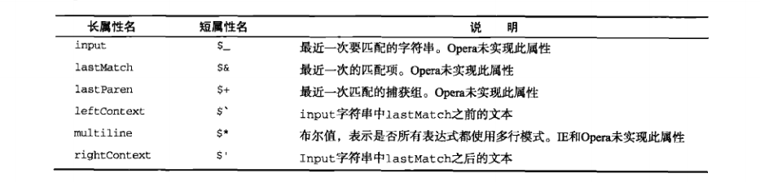

# 前言
>&emsp;&emsp;引用类型的值（对象）是**引用类型**的一个实例。引用类型是一种数据结构，用于将数据和功能组织在一起。`ECMAScript`从技术上将是一门面向对象的语言，但它不具备传统的面向对象语言所支持的类和接口等基本结构。引用类型有时候也被称为**对象定义**，因为它们秒速的是一类对象所具有的属性和方法。

`var person = new Object();` 
这行代码创建了Object引用类型的一个新实例。使用的*构造函数*是Object，它只为新对象定义了默认的属性和方法。

# 5.1 Object类型
1. 创建Object实例的方式有两种。
    * 使用new操作符后跟`Object`构造函数
    <pre><code>
        var person = new Object();
        person.name = "Nicholas";
        person.age = 29;
    </code></pre>
    * 使用对象字面量表示法（实际上不会调用Object构造函数）
    <pre><code>
        var person = {
            name : "Nicholas",
            age : 29
            //属性名可用字符串表示，也可以不用
            //"name" : "Nicholas"
        }
        //也可以留空花括号
        var person = {};    //与 new Object()相同
        person.name = "Nicholas";
        person.age = 29;
    </code></pre>
2. 访问对象属性的方法有两种
    * 点表示法
    * 方括号表示法
    <pre><code>
        console.log(person.name);
        console.log(person["name"]);
    </code></pre>
方括号语法的优点是可以通过变量来访问属性；如果属性名中包含会导致语法错误的字符，或者属性，名使用的是关键字或保留字，也可以用方括号。
<pre><code>
    //变量属性
    var propertyName = "name";
    console.log(person[propertyName]);  //Nicholas
    //会导致错误语法的字符
    person["first name"] = "Nicholas";
</code></pre>
**建议：**除非必须使用变量来访问属性，否则建议使用点表示法。

# 5.2 Array类型
1. 创建数组的基本方式有两种
    * 使用Array构造函数
    <pre><code>
        var colors = new Array();
        var colors = new Array(20);     //创建length为20的数组
        var colors = new Array("red","blue","green");   //创建包含3个字符串的数组
        var colors = Array(2);  //可以省略new关键字
    </code></pre>
    * 使用数组字面量表示法（不会调用Array构造函数）
    <pre><code>
        var colors = ["red","blue","green"];
        var values = [1,2,];    //不要这样！这样会创建一个包含2或3项的数组
        var options = [,,,,,];  //不要这样！这样会创建一个包含5或6项的数组
    </code></pre>
    **！注意：**在IE中，values会成为一个包含3个项目（最后一个为undefined）的数组；在其他浏览器中，values会成为一个包含2个项目的数组。options类似。**强烈建议不要使用这种语法**
2. 数组的`length`属性它不是只读的。通过设置这个属性，可以从数组的末尾移除项或向数组中添加新项。
    <pre><code>
        var colors = ["red","blue","green"];
        colors.length = 2;
        console.log(colors(2));     //undefined
        colors[length] = "orange";  //方便给数组添加新项
    </code></pre>
## 5.2.1 检测数组
对于*一个网页*或者*一个全局作用域*而言，使用`instanceof`足矣。如果网页中包含多个框架，那实际上就存在两个以上不同的全局执行环境，从而存在两个以上不同版本的`Array`构造函数。为解决这个问题，`ECMAScript 5`新增了`Array.isArray()`方法。这个方法用来确定某个值到底是不是数组，而不管它是在哪个全局执行环境中创建的。
<pre><code>
    if(Array.isArray(value)){
        //...
    }
</code></pre>
## 5.2.2 转换方法
* `toLocaleString()`
* `toString()`
* `valueOf()`
* `join()` 
如果数组中的某一项的值是`null`或者`undefined`，那么该值在以上4个方法返回的结果中以空字符串表示。
## 5.2.3 栈方法
* `push()`  返回数组的新长度
* `pop()`  返回移除的项
## 5.2.4 队列方法
* `shift()`     //返回移除的项
* `unshift()`   //返回数组的新长度 
`shift()`和`push()`结合使用；`unshift()`和`pop()`结合使用。 
**兼容性问题：**IE7及更早版本，`unshift()`方法总是返回`undefined`而不是数组的新长度。
## 5.2.5 重排序方法
1. `reverse()`：返回排序后的数组
2. `sort()`：返回排序后的数组
    * 默认情况下，`sort()`按升序排列数组项。`sort()`方法会调用每个数组项的`toString()`转型方法，然后比较得到的字符串。
    <pre><code>
        var values = [0,1,5,10,15];
        values.sort();
        alert(values);      //0,1,10,15,5
    </code></pre>
    *  ·`sort()`方法可以接收一个*比较函数*作为参数，以便我们指定哪个值位于哪个值的前面。比较函数通过返回一个小于零、等于零或大于零的值来影响排序结果。
## 5.2.6 操作方法
1. `concat()`：不影响原数组 
    `var colors2 = colors.concat("yellow",["black","brown"];`
2. `slice()`: 不影响原数组。基于当前数组创建一个新数组。 
    如果`slice()`方法的参数中有一个负数，则用数组长度加上该数来确定相应的位置。比如一个长度为5的数组上调用slice(-2,-1)与调用slice(3,4)得到的结果是一样的，如果结束位置小于起始位置，则返回空数组。
3. `splice()`：会影响原数组。返回数组中删除的项（没有删除元素则返回空数组） 
    `splice()`的3种用法： 
    * 删除：指定2个参数：眼删除的第一项的位置和要删除的项数。
    * 插入：至少3个参数：起始位置、0（要删除的项数）和要插入的项。插入多项后面传第四、第五以至任一多个项。
    * 替换：至少3个参数：起始位置、要删除的项数和要插入的任一数量的项。
    <pre><code>
        var colors = ["red","green","blue"];
        var removed = colors.splice(0,1);
        alert(colors);      //green,blue
        alert(removed);     //red
        ///////////////////////////////////////////////
        removed = colors.splice(1,0,"yellow","orange");
        alert(colors);      //green,yellow,orange,blue
        alert(removed);     //空数组
        ///////////////////////////////////////////////
        removed = colors.splice(1,1,"red","purple");
        alert(colors);      //green,red,purple,orange,blue
        alert(removed);     //yellow
    </code></pre>
## 5.2.7 位置方法
* `indexOf()`
* `lastIndexOf()`
这两个方法都接收两个参数：要查找的项和（可选）表示查找起点位置的索引。
## 5.2.8 迭代方法
>`ECMAScript 5`为数组定义了5个跌打方法。每个方法都接收2个参数：要在每一项上运行的函数和（可选）运行该函数的作用域对象——影响this的值。传入这些方法中额函数会接收3个参数：数组项的值、该项在数组中的位置和数组对象本身。

* `every()`：对数组中的每一项运行给定函数，如果该函数对每一项都返回`true`，则返回`true`。
* `fliter()`：对数组中的每一项运行给定函数，返回该函数会返回`true`的项组成的数组。
* `forEach()`：对数组中的每一项运行给定函数。这个方法没有返回值。
* `map()`：对数组中的每一项运行给定函数，返回每次函数调用的结果组成的数组。
* `some()`：对数组总的每一项运行给定函数，如果该函数对任一项返回`true`，则返回`true`。 
以上方法都不会修改数组中包含的值。
<pre><code>
    var numbers = [1,2,3,4,5,4,3,2,1];
    var everyResult = numbers.every(function(item,index,array){
        return (item>2);
    });
    //可以将every换成以上任一一个方法
</code></pre>
## 5.2.9 缩小方法
>&emsp;&emsp;`ECAScript 5`新增了两个缩小数组的方法：`reduce()`和`reduceRight()`。这两个方法都会迭代数组的所有项，然后构建一个最终返回的值。其中`reduce()`从数组的第一项开始，逐个遍历到最后。而`reduceRight()`则从数组的最后一项开始，向前遍历到第一项。 
&emsp;&emsp;这两个方法都接收2个参数：一个在每一项上调用的函数和（可选）作为缩小基础的初始值。传人这两个方法中的函数接收4个参数：前一个值、当前值、项的索引和数组对象。这个函数返回的任何值都会作为第一个参数自动传给下一项。第一次迭代发生在数组的第二项上，因此第一个参数是数组的第一项，第二个参数就是数组的第二项。

<pre><code>
    var values = [1,2,3,4,5];
    var sum = values.reduce(function(pre,cur,index,array){
        return pre + cur;
    });
    alert(sum);     //15
</code></pre>

# 5.3 Date类型
>`ECMAScript`中的`Date`类型是在早期Java中的`java.util.Date`类型基础上构建的。为此，`Date`类型使用自UTC(国际协调时间)1970年1月1日午夜（零时）开始经过的毫秒数来保存日期。在使用这种数据存储格式的条件下，`Date`类型保存的日期能够精确到1970年1月1日之前或之后的285616年。

1. 创建一个日期对象，使用new操作符和Date构造函数。
    `var now = new Date();  // 自动获得当前日期和时间`
2. 创建一个特定日期和时间对象，必须传入表示该日期的毫秒数（即从UTC时间起值该日期止经过的毫秒数）。`ECMAScript`提供了两个方法简化这一计算过程。
    * `Date.parse()`
    * `Date.UTC()`
3. `Date.parse()`接收一个表示日期的*字符串*参数，然后根据字符串返回毫秒数。支持以下日期格式：
    * “月/日/年”，如6/13/2017;
    * “英文月名 日,年”，如January 12,2004;
    * “英文星期几 英文月名 日 年 时:分:秒 时区”，如Tue May 25 2004 00:00:00 GMT-0700.
    * ISO 8610扩展格式 YYYY-MM-DDTHH:mm:ss.sssZ(例如：2004-05-25T00:00:00)。只有兼容`ECMAScript 5`的实现支持这种格式。
    * 如果传入`Date.parse()`的字符串不能表示日期，那么它会返回`NaN`。
    <pre><code>
        var someDate = new Date(Date.parse("May 25,2004"));
        //直接将表示日期的字符串传递给Date构造函数，也会在后台调用Date.parse().
        //换句话说，下面的代码与前面的例子等价：
        var someDate = new Date("May 25,2004");
    </code></pre>
**兼容性问题：**例如，在解析"January 32,2007"时，有的浏览器会将其解释为"February 1,2007"。而Opera则倾向于插入当前月份的当前日期，返回"January 当前日期, 2007"。也就是说，如果在2007年9月21日运行前面的代码，将会得到"January 21,2007"（都是21日）。 
4. `Date.UTC()`方法的参数分别是年份、基于0的月份（一月是0，二月是1，以此类推）、月中的哪一天（1到31）、小时数（0到23）、分钟、秒以及毫秒数。只有前两个参数年和月是必须的。如果没有提供日，则假设天数为1；如果省略其他参数，则统统假设为0.
<pre><code>
    //GMT时间2000年1月1日午夜零时
    var y2k = new Date(Date.UTC(2000,0));
    //GMT时间2005年5月5日下午5:55:55
    var allFives = new Date(Date.UTC(2005,4,5,17,55,55));
</code></pre>
与`Date.parse()`类似，可以直接在Date中传递参数。直接传递参数时，日期和时间都基于本地时区而非GMT（格林威治时间）来创建。
<pre><code>
    //本地时间2000年1月1日午夜零时
    var y2k = new Date(2000,0);
    //本地时间2005年5月5日下午5:55:55
    var allFives = new Date(2005,4,5,17,55,55);
</code></pre>
5. `ECMAScript 5`添加了`Date.now()`方法，返回表示调用这个方法时的日期和时间的毫秒数。 
`var start = Date.now();` 
在不支持`Date.now()`的浏览器中，使用+操作符把Date()转换成字符串。 
`var start = +new Date();`
## 5.3.1 继承的方法
1.  `toLocaleString()`按照与浏览器设置的地区相适应的格式返回日期和时间。一般格式中会包含AM或PM，但不会包含时区信息。
<pre><code>
    //chrom 版本 70.0.3538.110（正式版本）
    var start = new Date(2018,10,24,14,39,30).toLocaleString();
    console.log(start);     //2018/11/24 下午2:39:30
</code></pre>
2. `toString()`返回带有时区信息的日期和时间，小时的范围是0-23。
<pre><code>
    //chrom 版本 70.0.3538.110（正式版本）
    var start = new Date(2018,10,24,14,39,30).toString();
    console.log(start);     //Sat Nov 24 2018 14:39:30 GMT+0800 (中国标准时间)
</code></pre>
3. `valueOf()`返回日期的毫秒表示。因此，*可以方便使用比较操作符来比较日期值*。
<pre><code>
    var date1 = new Date(2018,9,15);
    var date2 = new Date(2018,10,15);
    alert(date1&lt;date2);     //true
    alert(date1>date2);     //false
</code></pre>
## 5.3.2 日期格式化方法
用于将日期格式化为字符串的方法，这些方法如下： 

* `toDateString()`——以特定于实现的格式显示星期几、月、日和年
* `toTImeString()`——以特定于显示的格式显示时、分、秒和时区
* `toLocaleDateString()`——以特定于地区的格式显示星期几、月、日和年；
* `toLocaleTimeString()`——以特定于实现的格式显示时、分、秒
* `toUTCString()`——以特定于实现的格式完整的UTC日期 

与`toLocaleString()`和`toString()`一样，以上这些字符串格式方法的输出也是因浏览器而异的，因此没有哪一个方法能够用来在用户界面中显示一致的日期信息。 
**建议：**`ECMAScript`推荐现在编写的代码一律使用`toUTCString()`方法。
## 5.3.3 日期/事件组件方法

# 5.4 RegExp类型
1. 以字面量形式创建一个正则表达式
`var expression = / pattern / flags;` 
其中的模式(pattern)部分可以是任何简单或复杂的正则表达式，可以包含字符类、限定符、分组、向前查找以及反向引用。每个正则表达式都可带有一或多个标志(flags)，用以标明正则表达式的行为。正则表达式的匹配模式支持下列3个标志。 
* g：表示全局(global)模式即模式将应用于所有字符串，而非发现第一个匹配项时立即停止；
* i：表示不区分大小写模式；
* m：表示多行(multiline)模式，即在到达一行文本末尾时还会继续查找下一行是否存在于模式匹配的项。
<pre><code>
    //匹配字符串中所有“at”的实例
    var pattern1 = /at/g;
    //匹配第一个"bat"或"cat"，不区分大小写
    var pattern2 = /[bc]at/i;
    //匹配第一个"[bc]at",不区分大小写
    var pattern3 = /\[bc\]at/i;
    //匹配所有以"at"结尾的3个字符的组合，不区分大小写
    var pattern4 = /.at/gi;
    //匹配所有".at"，不区分大小写
    var pattern5 = /\.at/gi;
</code></pre> 
模式中使用的所有元字符都必须转义。正则表达式中的元字符包括： 
( [ { \ ^ $ | ? * + . } ] ) 
如pattern3和pattern5
2. 使用RegExp构造函数创建一个正则表达式 
它接收2个参数：要匹配的**字符串**模式和（可选）标志**字符串**。 
<pre><code>
    //匹配第一个"bat"或"cat"，不区分大小写
    var pattern1 = /[bc]at/i;
    //于pattern1相同，使用构造函数创建
    var pattern2 = new RegExp("[bc]at","i");
</code></pre>
由于RegExp构造函数的模式参数是字符串，所以在某些情况下要对字符进行双重转义。所有元字符都必须双重转义，那些已经转义过的字符也是如此。例如\n（字符\在字符串中通常被转义为\\\\，而在正则表达式字符串中就会变成\\\\\\\\）。下表给出了一些模式。 

使用字面量或构造函数创建的每一个新RegExp实例都是一个新实例。
## 5.4.1 RexExp实例属性
>  `RexExp`的每个实例都具有下列属性，通过这些属性可以取得有关模式的各种信息。

* `global`：布尔值，表示设置了g标志。
* `ingoreCase`：布尔值。表示是否设置了i标志。
* `lastIndex`：整数，表示开始搜索下一个匹配项的字符位置，从0算起。
* `multiline`：布尔值，表示是否设置了m标志。
* `source`：正则表达式的字符串表示，按照字面量形式而非传入构造函数中的字符串模式返回。 
<pre><code>
    var pattern1 = /\[bc\]at/i;
    var pattern2 = new RegExp("\\[bc\\]at","i");
    alert(pattern1.source);     //"\[bc\]at"
    alert(pattern2.source);     //"\[bc\]at"
</code></pre>
## 5.4.2 RegExp实例方法
1. `exec()`接收1个参数，即要应用模式的字符串，然后返回包含第一个匹配项信息的数组；没有匹配项返回`null`。返回的数组虽然是Array的实例但包含两个额外的属性：`index`和`input`。其中，`index`表示匹配项在字符串中的位置，而`input`表示应用正则表达式的字符串。在数组中，第一项是整个模式匹配的字符串，其他项是与模式中的捕获组匹配的字符串（如果模式中没有捕获组，则该数组只包含一项）。
<pre><code>
    var text = "mom and dad and baby";
    var pattern = /mom( and dad( and baby)?)?/gi;
    var matches = pattern.exec(text);
    console.log(matches.index);     //0
    console.log(matches.input);     //"mom add dad and baby"
    console.log(matches[0]);        //"mom add dad and baby"
    console.log(matches[1]);        //" and dad and baby"
    console.log(matches[2]);        //" and baby"
</code></pre>
2. `test()`接收一个字符串参数，在模式与该参数匹配是返回`true`，否则返回`false`.
3. `RegExp`实例继承的`toLocaleString()`和`toString()`都会返回正则表达式的字面，量，与创建正则表达式的方式无关。
<pre><code>
    var pattern = new RegExp("\\[bc\\]at","gi");
    alert(pattern.toString());          //  /\\[bc\\]at/
    alert(pattern.toLocaleString());    //  /\\[bc\\]at/
</code></pre>
## 5.4.3 RegExp构造函数属性

