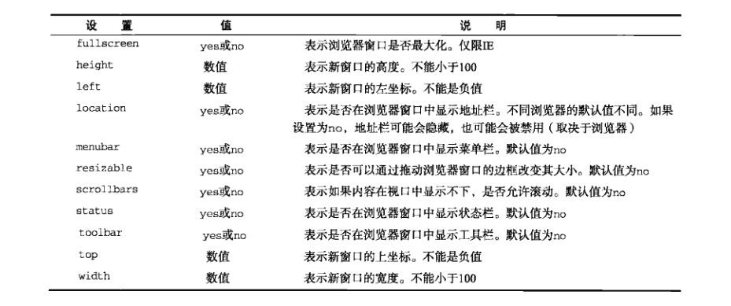
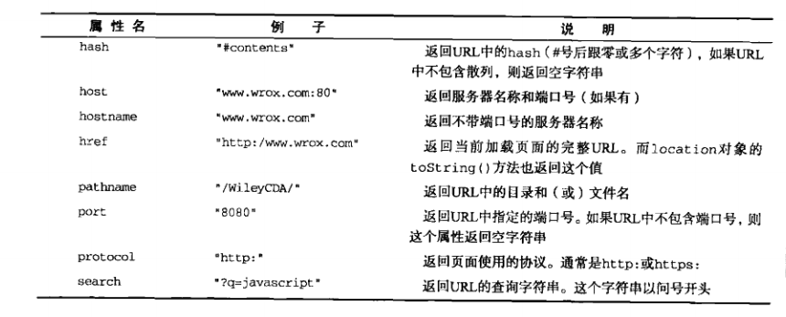

# 8.1 window对象
`BOM`（浏览器对象模型）的核心是`window`，它表示浏览器的一个实例。在浏览器中，`window`对象有双重角色，它既是通过`JavaScript`访问浏览器窗口的一个接口，又是`ECMAScript`规定的`Global`对象。
## 8.1.1 全局作用域
1. 由于`window`对象同时扮演着`ECMAScript`中`Global`对象的角色，因此所有在全局作用域中声明的变量、函数都会变成`window`对象的属性和方法。
```
    var age = 29;
    function sayAge(){
        alert(this.age);
    }
    alert(window.age);  //29
    sayAge();           //29
    window.sayAge();    //29
```
2. 抛开全局变量会成为`window`对象的属性不谈，定义全局变量与在`window`对象上直接定义属性还是有一点差别： **全局变量不能通过`delete`操作符删除，而直接在`window`对象上的定义的属性可以。**
```
    var age = 29;
    window.color = "red";
    //在IE9之前的版本会报错，其他浏览器中都返回false
    delete window.age;
    //在IE9之前的版本会报错，其他浏览器中都返回true
    delete window.color;
    alert(window.age);      //29
    alert(window.color);    //undefined
```
    这是因为使用`var`语句添加的`window`属性有一个名为`[[Configurable]]`的特性，这个特性的值被设置为`false`，因此这样定义的属性不可能通过`delete`操作符删除。<br>
3. **尝试访问未声明的变量会抛出错误，但是通过查询`window`对象，可以知道某个可能未声明的变量是否存在。**
```
    //这里会抛出错误，因为oldValue未定义
    var newValue = oldValue;
    //这里不会抛出错误，因为这是一次属性查询
    var newValue = window.oldValue;
```

## 8.1.2 窗口关系及框架
1. 如果页面中包含框架，则每个框架都拥有自己的`window`对象，并且保存在`frames`集合中。在`frames`集合中，可以通过数值索引（从0开始，从左至右，从上至下）或者框架名称来访问相应的`window`对象。每个`window`对象都有一个`name`属性，其中包含框架的名称。
```
    <html>
        <head>
            <title>Frameset Example</title>
        </head>
        //不能与 <frameset></frameset> 标签一起使用 <body></body> 标签。
        //不过，如果需要为不支持框架的浏览器添加一个 <noframes> 标签，
        //请务必将此标签放置在 <body></body> 标签中！
        <frameset rows="160,*">
            <frame src="frame.html" name="topFrame">
            <frameset col="50%,50%">
                <frame src="anotherframe.html" name="leftFrame">
                <frame src="yetanotherframe.html" name="rightFrame">
            </frameset>
        </frameset>
    </html>
```
    以上代码创建了一个框架集，其中一个框架居上，两个框架居下。对这个例子而言，可以通过`windown.frames[0]`或者`window.frames["topFrame"]`来引用上方的框架。
2. `top`对象始终指向最高（最外）层的框架，也就是浏览器窗口。使用它可以确保在一个框架中正确地访问另一个框架。因为对于在一个框架中编写的任何代码来说，其中的`window`对象指向的都是那个框架的特定实例，而非最高层的框架。
3. 与`top`相对的另一个`window`对象是`parent`。`parent`对象始终指向当前框架的直接上层框架。
```
    <html>
        <head>
            <title>Frameset Example</title>
        </head>
        <frameset rows="160,*">
            <frame src="frame.html" name="topFrame">
            <frameset col="50%,50%">
                <frame src="anotherframe.html" name="leftFrame">
                ///////////////////////////////////////////////////////
                <frame src="anotherframeset.html" name="rightFrame">
                ///////////////////////////////////////////////////////
            </frameset>
        </frameset>
    </html>
```
    如果anotherframeset.html这个框架中包含了另外一个框架，该框架代码如下：
```
    <html>
        <head>
            <title>Frameset Example</title>
        </head>
        <frameset cols="50%,50%">
            <frame src="red.html" name="redFrame">
            <frame src="blue.html" name="blueFrame">
        </frameset>
    </html>
```
    浏览器在加载完第一个框架集后，会继续在第二个框架集加载到rightFrame中。如果 *代码* 位于redFrame（或blueFrame）中，那么`parent`对象指向的就是rightFrame。如果 *代码* 位于topFrame中，则`parent`指向的是top，因为topFrame的直接上层框架就是最外层框架。<br>
    **注意：** 除非最高层窗口是通过`window.open()`打开的，否则其`window`对象的`name`属性不会包含任何值。
4. `self`对象，始终指向`window`；`self`和`window`对象可以互换使用。
5. 所有这些对象都是`window`对象的属性，可以通过`window.parent`、`window.top`等形式来访问。同时，可以将不同层次的`window`对象连缀起来，如`window.parent.parent.frames[0]`。
6. **注意：** 在使用框架的情况下，浏览器会存在多个`Global`对象。在每个框架中定义的全局变量会自动成为框架中`window`对象的属性。由于每个`wondow`对象都包含原生类型的构造函数，因此每个框架都有一套自己的构造函数，这些构造函数一一对应，但并不相等。例如，`top.Object`并不等于`top.frames[0].Object`。这个问题会影响到对跨框架传递的对象使用`instanceof`操作符。

## 8.1.3 窗口位置
IE、Safari、Opera和Chrome都提供了`screeLeft`和`screeTop`属性，分别用于表示窗口相对于屏幕左边和上边的位置。Firefox则在`screenX`和`screenY`属性中提供相同的窗口位置信息，Safari和Chrome也同时支持这两个属性。Opera虽然也支持这两个属性，但与`screeLeft`和`screeTop`属性并不对应，因此建议不要在`Opera`中使用它们。跨浏览器的兼容写法：
```
    var leftPos = (typeof window.screenLeft == "number") ? window.screenLeft : window.screenX;
    var topPos = (typeof window.screenTop == "number") ? window.screenTop : window.screenY;
```
Firefox、Safari和Chrome始终返回页面中每个框架的`top.screenX`和`top.screenY`值。即使在页面由于被设置了外边距而发生偏移的情况下，相对于`window`对象使用`screenX`和`screenY`每次也都会返回相同的值。而IE和Opera则会给出框架相对于屏幕便捷的精确坐标值。最终结果就是无法在跨浏览器的条件下取得窗口左边和上边的精确坐标值。然而，使用`moveTo()`和`moveBy()`方法倒是有可能将窗口精确地移动到一个新位置。这两个方法都接收两个参数，其中`moveTo()`接收的是新位置的x和y坐标值，而`moveBy()`接收的是在水平和垂直方向上移动的像素数。
```
    //将窗口移动到屏幕左上角
    window.moveTo(0,0);
    //将窗口向下移动100像素
    window.moveBy(0,100);
    //将窗口移动到(200,300);
    window.moveTo(200,300);
    //将窗口向左移动50像素；
    window.moveBy(-50,0);
```
需要 **注意** 的是，这两个方法可能会被浏览器禁用。另外，这两个方法都不适用于框架，只能对最外层的`window`对象使用。

## 8.1.4 窗口大小
IE9+、Firefox、Safari、Opera和Chrome都提供了四个属性：`innerWidth`和`innerHeight`，`outerWidth`和`outerHeight`。但是在各个浏览器之间的表现都不一样。最终无法确定浏览器窗口本身的大小，但却可以取得页面视口的大小。
```
    var pageWidth = window.innerWidth;
    var pageHeight = window.innerHeight;
    if(typeof pageWidth != "number"){
        if(document.compatMode == "CSS1Compat"){    //这个用来确定页面是否处于标准模式
            pageWidth = document.documentElement.clientWidth;
            pageHeight = document.documentElement.clientHeight;
        }else{
            pageWidth = document.body.clientWidth;
            pageHeight = document.body.clientHeight;
        }
    }
```
对于移动设备，window.innerWidth和window.innerHeight保存着可见视口，也就是屏幕上可见页面区域的大小。在移动浏览器中，document.documentElement度量的是布局视口，即渲染后页面的实际大小。移动IE浏览器的布局视口信息保存在document.body中。<br>
另外，使用`resizeTo()`和`resizeBy()`方法可以调整浏览器窗口的大小，与`moveTo()`和`moveBy()`类似。

## 8.1.5 导航和打开窗口
使用`window.open()`方法既可以导航到一个特定的URL，也可以打开一个新的浏览器窗口。这个方法可以接收4个参数：要加载的URL、窗口模板、一个特性字符串以及一个表示新页面是否取代浏览器记录中当前加载页面的布尔值。第二个参数的值可以是窗口或框架的名称、`_self`、`_parent`、`_top`或`_blank`。如果窗口或框架的名称是已有的窗口或框架，那么就会在其有该名称的窗口或框架中加载第一个参数指定的URL；否则，会创建一个新窗口并将其命名为该名称。
```
    //等同于<a href="http://www.wrox.com" target="topFrame"></a>
    window.open("http://www.wrox.com/", topFrame);
```
1. 弹出窗口

* 如果给`window.open()`传递的第二个参数并不是一个已经存在的窗口或框架，那么该方法就会根据在第三个参数位置上传入的字符串创建一个新窗口或新标签页。如果没有传入第三参数，那么就会打开一个带有全部默认设置（工具栏、地址栏和状态栏等）的新浏览器窗口（或者打开一个新标签页——根据浏览器设置）。在不打开新窗口的情况下，会忽略第三个参数。<br>
* 第三个参数是一个逗号分隔的设置字符串，表示在新窗口中都显示哪些特性。下表列出了可以出现在这个字符串中的设置选项。

    表中所列的部分或全部设置选项，都可以通过逗号分隔的名值对列表来指定。其中，名值对以等号表示（ **注意：** 整个特性字符串中不允许出现空格）。
`window.open("http://www.wrox.com/","wroxWindow","height=400,width=400,top=10,left=10,resizable=yes");`
* `window.open()`方法返回一个指向新窗口的引用。引用的对象与其他`window`对象大致相似，但我们可以对其进行更多控制。
```
    var wroxWin = window.open("http://www.wrox.com/","wroxWindow","height=400,width=400,top=10,left=10,resizable=yes");
    //调整大小
    wroxWin.resizeTo(500,500);
    //移动位置
    wroxWin.moveTo(100,100);
    //关闭新打开的窗口
    wroxWin.close();
```
* `close()`只能关闭`window.open()`打开的弹出窗口。对于浏览器的主窗口，如果没有得到用户的允许是不能关闭它的。不过，弹出窗口可以调用`top.close()`在不经用户允许的情况下关闭自己。弹出窗口关闭之后，窗口的引用仍然还在，但除了像下面这样检测其`closed`属性之外，已经没有其他用处了。
```
    wroxWin.close();
    alert(wroxWin.closed);  //true
```
* 新创建的`window`对象有一个`opener`属性保存着 *打开它的原始窗口对象* 。这个属性只在弹出窗口中的 **最外层`window`** 对象(top)中有定义，而且指向调用`window.open()`的窗口或框架。<br>
`alert(wroxWin.opener == window);   //true` <br>
但原始窗口没有指向弹出窗口的指针。
* IE8和Chrome会在独立的进程中运行每个标签页。当一个标签页打开另一个标签页时，如果两个`window`对象直接需要彼此通信，那么新标签页就不能运行在独立的进程中。在Chrome中将新创建的标签页的`opener`属性设置为`null`，即表示在单独的进程中运行新标签页。<br>
`wroxwin.opener = null;`

2.弹出窗口屏蔽程序<br>
在弹出窗口被屏蔽时，要考虑两种可能性。如果是浏览器内置的屏蔽程序阻止的弹出窗口，那么`window.open()`很可能会返回`null`。此时，只要检测这个返回的值就可确定弹出窗口是否被屏蔽了。如果是浏览器扩展或其他程序阻止的弹出窗口，那么`window.open()`通常会抛出一个错误。因此，把`window.open()`的调用封装在一个`try-catch`块中。
```
    var blocked = false;
    try {
        var wroxWin = window.open("http://www.wrox.com/", "_blank");
        if(wroxWin == null){
            blocked = true;
        }
    }catch (ex){
        bloked = true;
    }
    if(blocked){
        alert("The popup was blocked!");
    }   
```
以上代码只能检测弹出窗口是否被屏蔽，但并不会阻止浏览器显示与被屏蔽的弹出窗口有关的消息。
## 8.1.6 间歇调用和超时调用
`JavaScript`是单线程语言，但它允许通过设置超时值和间歇时间值来调度代码在特定的时刻执行。

* 超时调用使用`window`对象的`setTimeout()`方法。
```
    //不建议传递字符串，因为可能导致性能损失
    setTimeout("alert('Hello world!')", 1000);
    //推荐的调用方式
    setTimeout(function(){
        alert("Hello world!");
    },1000);
```
**重要：** 第二个参数是一个表示等待多次时间的毫秒数，但经过该时间后指定的代码不一定会执行。`JavaScript`是一个单线程序的解释器，因此一定时间内只能执行一段代码。为了控制要执行的代码，就有一个`JavaScript`任务队列。这些任务会按照将它们添加到队列的顺序执行。`setTimeout()`的第二个参数告诉`JavaScript`再过多长时间把当前任务添加到队列中。如果队列是空的，那么添加的代码会立即执行‘如果队列不是空的，那么它就要等前面的代码执行完了以后再执行。<br>
超时调用的代码都是在全局作用域中执行的，因此函数中`this`的值在非严格模式下指向`window`对象，在严格模式下是`undefined`。
* 间歇调用使用`setInterval()`方法。
* 一般认为， **使用超时调用来模拟间歇调用的是一种最佳模式** 。在开发环境下，很少使用真正的间歇调用，原因是后一个间歇调用可能会在前一个间歇调用结束之前启动。而用超时调用来模拟间歇调用则可以完全避免这一点。
```
    var num = 0;
    var max = 10;
    function incrementNumber(){
        num ++;
        //如果执行次数未达到max设定的值，则设置另一次超时调用
        if(num<max){
            setTimeout(incrementNumber, 500);
        }else{
            alert("Done");
        }
    }
    setTimeout(incrementNumber, 500);
```

## 8.1.7 系统对话框
`alert()`、`confirm()`、`prompt()`可以调用系统对话框向用户显示消息。系统对话框与在浏览器中显示的网页没有关系，也不包含`HTML`。它们的外观由操作系统及（或）浏览器设置决定，而不是由`CSS`决定。此外，显示这些对话框的时候代码会停止执行，而关掉后代码又会恢复执行。
* `alert()`接收一个 *字符串* 并将其显示给用户
* `confirm()`点击确定返回true，点击取消或关闭返回false。确认对话框的典型用法如下：
```
    if(confirm("Are you sure?")){
        alert("I'm so glad you're sure!");
    }else{
        alert("I'm sorry to hear you not sure.");
    }
```
* `prompt()`用于提示用户输入一些文本。接收2个参数：要显示给用户的文本提示和文本输入域的默认值（可以是一个空字符串）。<br>
`prompt("What's your name?", "Michael");`<br>
点击确定返回true，否则返回false。
* `print()`和`find()`。这两个对话框都是异步显示的，能够将控制权立即交还给脚本。这两个对话框与用户通过浏览器菜单的“查找”和“打印”命令打开的对话框相同。
```
    window.print();
    window.find();
```

# 8.2 location对象
`location`对象提供了与当前窗口中加载的文档有关的信息，还提供了一些导航功能。它既是`window`对象的属性，也是`document`对象的属性；换句话说，`window.location`和`document.location`引用的是同一个对象。`location`对象的用处不只表现在它保存着当前文档的信息，还表现在它将URL解析为独立的片段，让开发人员可以通过不同的属性访问这些片段。下表列出了`location`对象的所有属性。
 

## 8.2.1 查询字符串参数
创建一个函数，用以解析查询字符串，然后返回包含所有参数的一个对象。
```
    function getQueryStringArgs(){
        var qs = location.search.length > 0 ? location.search.substring(1) : "";
        var args = [];
        var items = qs.length ? qs.split("&") : [];
        var item = null;
        var name = null;
        var value = null;
        var len = items.length;
        for(var i=0;i<len;i++){
            item = items[i].split("=");
            //因为查询字符串应该是被编码过的，所以先解码
            name = decodeURIComponent(item[0]);
            value = decodeURIComponent(item[1]);
            if(name.length){
                args[name] = value;
            }
        }
        return args;
    }
```
