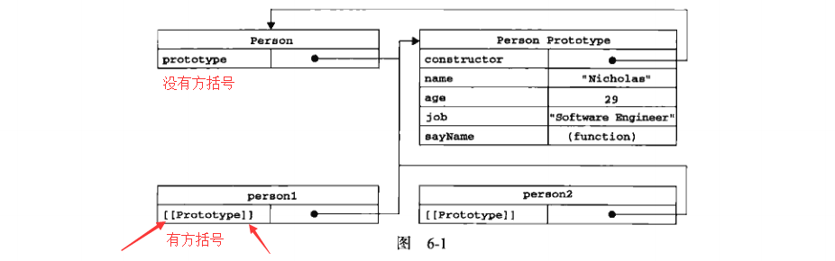

# 前言
>`ECMA-262`把对象定义为：“无序属性的集合，其属性可以包含基本值、对象或者函数。”严格来讲，这就相当于说对象是第一组没有特定顺序的值。对象的每个属性或方法都有一个名字，而每个名字都映射到一个值。因此，我们可以把`ECMAScript`的对象想象成散列表：无非就就是一组名值对，其中值可以是数据或函数。每个对象都是基于一个引用类型创建的，引用类型可以是第5章讨论的原生类型，也可以是开发人员定义的类型。

# 6.1理解对象
## 6.1.1 属性类型
>`ECMA-262`第5版在定义只有内部才用的特性时，描述了属性的各种特征。`ECMA-262`定义这些特性时为了实现`JavaScript`引擎用的，因此在`JavaScript`中不能直接访问它们。为了表示特性是内部值，该规范把它们放在了两对儿方括号中，例如\[\[Enumerable\]\]。
`ECMAScript`中有两种属性：数据属性和访问器属性。

1. 数据属性
>包含一个数据值的位置。在这个位置可以读取和写入值。

    * \[\[Configurable\]\]:表示能否通过`delete`删除属性从而重新定义属性，能否修改属性的特性，或者能否把属性修改为访问器属性。直接在对象上定义的属性，它们的这个特性默认值为`true`。
    * \[\[Enumerable\]\]:表示能否通过`for-in`循环返回属性。直接在对象上定义的属性，它们的这个特性默认值为`true`。
    * \[\[Writable\]\]:表示能否修改属性的值。直接在对象上定义的属性，它们的这个特性默认值为`true`。
    * \[\[Value\]\]:包含这个属性的数据值。读取属性值的时候，从这个位置度；写入属性值的时候，把新值保存在这个位置。这个特性的默认值为`undefined`。
    <pre><code>
        var person = {
            name : "Nicholas"
        }
    </code></pre>
    创建一个名为name的属性，它的\[\[Configurable\]\]、\[\[Enumerable\]\]、\[\[Writable\]\]特性都被设置为`true`，\[\[Value\]\]被设置为"Nicholas"。 
    使用`object.defineProperty()`修改属性默认的特性。这个方法接收3个参数：属性所在的对象、属性的名字和一个描述符对象。其中，描述符对象的属性必须是：configurable、enumerable、writable和value。
    <pre><code>
        var person = {};
        Object.defineProperty(person, "name", {
            writbale: false,
            value: "Nicholas"
        });
        alert(person.name);     //"Nicholas"
        person.name = "Greg";
        alert(person.name);     //"Nihcolas"
    </code></pre>
    **注意：**一旦把configurable设置为false，就不能再把它变回可配置了。

2. 访问器属性
>访问器属性不包含数据值；它们包含一对`getter`和`setter`函数（这两个函数不是必须的）；它们有如下4个特性。

    * \[\[Configurable\]\]:表示能否通过`delete`删除属性从而重新定义属性，能否修改属性的特性，或者能否把属性修改为访问器属性。直接在对象上定义的属性，它们的这个特性默认值为`true`。
    * \[\[Enumerable\]\]:表示能否通过`for-in`循环返回属性。直接在对象上定义的属性，它们的这个特性默认值为`true`。
    * \[\[Get\]\]:在读取属性时调用的函数。默认值为`undefinedn`。
    * \[\[Set\]\]:在写入属性时调用的函数。默认值为`undefinedn`。
    访问器属性不能直接定义，必须使用`Object.defineProperty()`来定义。
    <pre><code>
        var book = {
            _year: 2004,
            edition: 1
        };
        Object.defineProperty(book, "year", {
            get: function(){
                return this._year;
            },
            set: function(newValue){
                if(newValue > 2004){
                    this._year = newValue;
                    this.edition += newValue - 2004;
                }
            }
        });
        book.year = 2005;
        alert(book.edition);    //2
    </code></pre>

## 6.1.2 定义多个属性
>`Object,defineProperties()`通过描述符一次定义多个属性。这个方法接收两个对象参数：第一个对象是要添加和修改其属性的对象，第二个对象的属性与第一个对象中要添加或修改的属性一一对应。

<pre><code>
    var book = {};
    Object.defineProperties(book, {
        _year: {
            value: 2004
        },
        edition: {
            value: 1
        },
        year: {
            get: function(){
                return this._year;
            },
            set: function(newValue){
                if(newValue > 2004){
                    this._year = newValue;
                    this.eidtion += newValue - 2004;
                }
            }
        }
    });
</code></pre>
以上代码定义了两个数据属性（_year和edition）和一个访问器属性（year）。
## 6.1.3 读取属性的特性
>`Object.getOwnPropertyDescriptor()`方法，可以取得给定属性的描述符。这个方法接收两个参数：属性所在的对象和要读取其描述符的属性名称。返回值是一个对象。

<pre><code>
    //以上面book对象为例
    //对于数据属性_year
    var descriptor = Object.getOwnPropertyDescriptor(book, "_year");
    alert(descriptor.value);    //2004
    alert(descriptor.configurable);     //false
    alert(typeof descriptor.get);       //"undefined"
    //对于访问器属性year
    var descriptor = Object.getOwnPropertyDescriptor(book, "year");
    alert(descriptor.value);    //undefined
    alert(descriptor.enumerable);     //false
    alert(typeof descriptor.get);       //"function"
</code></pre>

# 6.2创建对象
>使用Object构造函数或对象字面量创建很多对象，会产生大量的重复代码。为此，人民开始使用工厂模式的一种变体。

## 6.2.1 工厂模式
>用函数来封装以特定接口创建对象的细节。

<pre><code>
    function createPerson(name, age, job){
        var o = new Object();
        o.name = name;
        o.age = age;
        o.job = job;
        o.sayName = function(){
            alert(this.name);
        }
        return o;
    }
    var person1 = createPerson("Nicholas",29,"Software Enginerr");
    var person2 = createPerson("Greg", 27, "Doctor");
</code></pre>
工厂模式虽然解决了创建多个相似对象的问题，但却没有解决对象识别的问题（即怎样知道一个对象的类型）。

## 6.2.2 构造函数模式
<pre><code>
    function Person(name, age, job){
        this.name = name;
        this.age = age;
        this.job = job;
        this.sayName = function(){
            alert(this.name);
        }
    }
    var person1 = new Person("Nicholas", 29, "Software Engineer");
    var person2 = new Person("Greg", 27, "Doctor");
</code></pre>
Person()中的代码与createPerson()的不同之处： 

* 没有显式地创建对象；
* 直接将数学和方法赋值给了`this`对象；
* 没有`return`语句
此外，函数名使用大写字母P开头。**建议：**构造函数始终都应该以一个大写字母开头，而非构造函数则应该以一个小写字母开头。 
person1和person2分别保存着Person的一个不同的实例。这两个对象都有一个`constructor`（构造函数）属性，该属性指向Person。
<pre><code>
    alert(person1.constructor == Person);   //true
</code></pre>
person1和person2既是Object对象的实例，同时也是Person的实例。
<pre><code>
    alert(person1 instanceof Person);   //true
    alert(person1 instanceof Object);   //true
</code></pre>
创建自定义的构造函数意味着将来可以将它的实例标识为一种特定的类型。 
以这种方式定义的构造函数是定义在`Global`对象（在浏览器中是`window`对象）中的。 

1. 将构造函数当做函数
>构造函数与其他函数的唯一区别，就在于调用它们的方式不同。任何函数，只要通过`new`操作符来调用，那它就可以作为构造函数；而任何函数，如果不通过`new`操作符来调用，那它跟普通函数也不会有什么两样。

    <pre><code>
        //当做构造函数使用
        var person = new Person("Nichlas", 29, "Software Engineer");
        person.sayName();   //"Nicholas"
        //作为普通函数调用
        Person("Greg", 27, "Doctor");   // 添加到window
        window.sayName();   //Greg
        //在另一个对象的作用域中调用
        var o = new Object();
        Person.call(o, "Kristen", 25, "Nurse");
        o.sayName();    //"Kristen"
    </code></pre>

2. 构造函数的问题
>使用构造函数的主要问题，就是每个方法都要在每个实例上重新创建一遍。在前面的例子中，person1和person2都要一个名为sayName()的方法，但那两个方法不是同一个Function的实例。函数是对象，因此每定义一个函数，也就是实例化了一个对象。以这种方式创建函数，会导致不同的作用域链和标识符解析。没有必要创建两个完成同样任务的Function实例。
## 6.2.3 原型模式
>我们创建的每个函数都有一个`prototype`（原型）属性，这个属性是一个指针，指向一个对象，而这个对象的用途是包含可以用特定类型的所有实例共享的属性和方法。如果按照字面意思来理解，那么`prototype`就是通过调用构造函数而创建的那个对象实例的原型对象。使用原型对象的好处是可以让所有对象实例共享它所包含的属性和方法。换句话说，不必再构造函数中定义对象实例的信息，而是可以将这些信息直接添加到原型对象中。

<pre><code>
    function Person(){}
    Person.prototype.name = "Nicholas";
    Person.prototype.age = 29;
    Person.prototype.job = "Software Engineer";
    Person.prototype.sayName = function(){
        alert(this.name);
    }
    var person1 = new Person();
    person1.sayName();      //"Nicholas"
    var person2 = new Person();
    person2.sayName();      //"NIcholas"
    alert(person1.sayName == person2.sayName);      //true
</code></pre>
1. 理解原型对象
>只要创建一个新函数，就会为该函数创建一个`prototype`（原型）属性，这个属性指向函数的原型对象。默认情况下，所有原型对象都会自动获得一个`constructor`（构造函数）属性，这个属性包含一个指向`prototype`属性所在函数的指针。以上面代码为例，即: 
`Person.prototype.constructor == Person` 

    &emsp;&emsp;当调用构造函数创建一个新实例后，该实例的内部将包含一个指针，指向构造函数的原型对象。`ECMA-262`第5版中管这个指针叫\[\[Prototype\]\]。虽然在脚本中没有标准的方式访问\[\[Prototype\]\]，但Firefox、Safari和Chrome在每个对象上都支持一个属性`__proto__`；而在其他实现中，这个属性对脚本则是完全不可见的。这个连续存在于*实例*与*构造函数的原型对象*之间，而不是存在于实例与构造函数直接。 
    &emsp;&emsp;下图展示各个对象之间的关系：

它们之间的关系如下： 
①Person.prototype指向原型对象； 
②Person.prototype.constructor指向Person； 
③person1.__proto__指向Person.prototype; 
④指向可以理解为(==) 
&emsp;&emsp;虽然在所有事项中都无法访问到\[\[Prototype\]\]，但可以通过`isPrototype()`方法来确定对象之间是否存在这种关系。如果\[\[Prototype\]\]指向调用`isPrototypeOf()`方法的对象（Person.prototype），那么这个方法就返回`true`。
<pre><code>
    console.log(Person.prototype.isPrototypeOf(person1));  //true
</code></pre>
`ECMAScript 5`新增方法`Object.getPrototypeOf()`，在所有支持的实现中，这个方法返回\[\[Prototype\]\]的值。
<pre><code>
    console.log(Object.getPrototypeOf(person1) == Person.prototype);    //true
    console.log(Object.getPrototypeOf(person1).name);   //Nicholas
</code></pre>
每当代码读取某个对象的某个属性时，都会执行一次搜索，目标是具有给定名字的属性。搜索首先从对象实例本身开始。如果在实例中找到了具有给定名字的属性，则返回该属性的值；如果没有找到，则继续搜索指针指向的原型对象，在原型对象中查找具有给定名字的属性。如果在原型对象中找到了这个属性，则返回该属性的值。 
原型最初只包含`constructor`属性，而该属性也是共享的，因此可以通过对象实例访问。
虽然可以 通过对象实例访问保存在原型中的值，但却不能通过对象实例重写原型中的值。如果我们在实例中添加了一个与实例原型中的同名属性，那该属性将会屏幕原型中的那个属性，而不是重写。
<pre><code>
    //同样以上面Person为例
    person1.name = "Greg";
    console.log(person1.name);  //"Greg"——来自实例
    console.log(person2.name);  //"Nicholas"——来自原型
</code></pre>
搜索属性时，先在实例中搜索，实例中搜索不到才去原型对象中搜索。 
可以使用`delete`删除实例属性
<pre><code>
    //同样以上面Person为例
    person1.name = "Greg";
    console.log(person1.name);  //"Greg"——来自实例
    console.log(person2.name);  //"Nicholas"——来自原型
    delete person1.name;
    console.log(person1.name);  //"Nicholas"
</code></pre>
使用`hasOwnProperty()`方法可以检测一个属性是存在于实例中还是原型中。这个方法只在给定属性存在于对象实例中时才返回`true`。
<pre><code>
    //同样以上面Person为例
    console.log(person1.hasOwnProperty("name"));    //false
    person1.name = "Greg";
    console.log(person1.hasOwnProperty("name"));    //true
    delete person1.name;
    console.log(person1.hasOwnProperty("name"));    //false
</code></pre>
`ECMAScript 5`的`Object.getOwnPropertyDescriptor()`方法只能用于实例属性，要取得原型属性的描述符，必须直接在原型对象上调用`Object.getOwnPropertyDescriptor()`。

2. 原型与in操作符
>有两种方式使用`in`操作符：单独使用和在`for-in`循环中使用。在单独使用时，`in`操作符会在通过对象能够访问给定属性时返回`true`，无论该属性存在于实例中还是原型中。 
`console.log("name" in person1);` 

    同时使用`hasOwnProperty()`方法和`in`操作符，就可以确定该属性到底存在于实例中还是存在于原型中。
<pre><code>
    function hasPrototypeProperty(object, name){
        return !object.hasOwnProperty(name) && (name in object);
    }
</code></pre>
