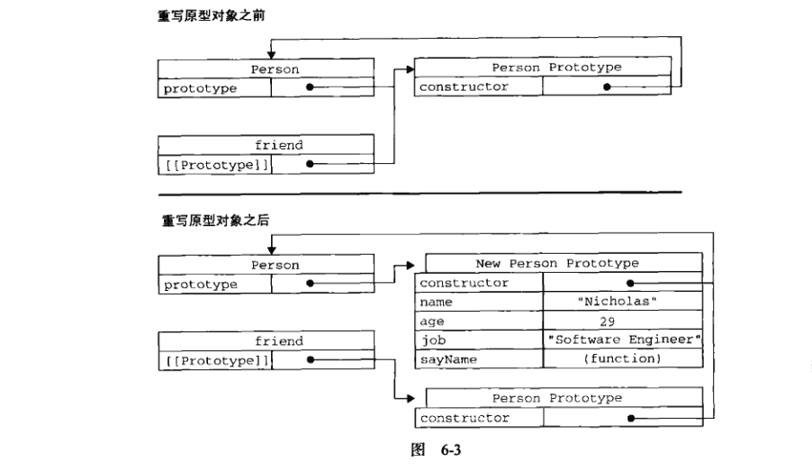
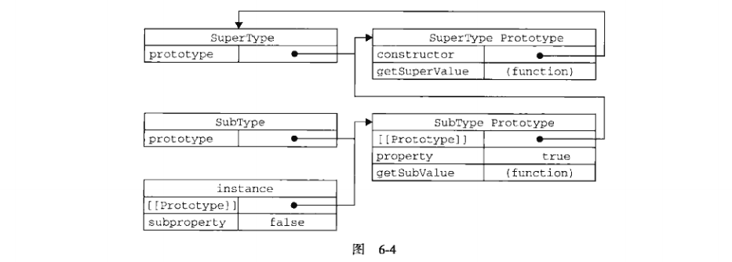
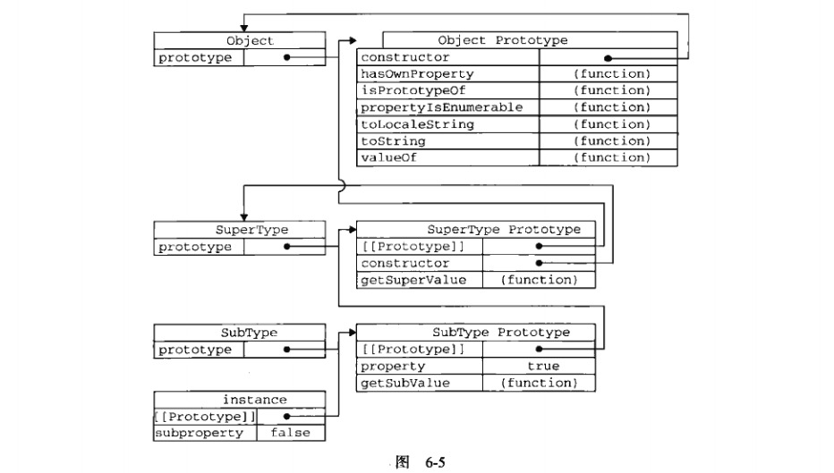

# 前言
>`ECMA-262`把对象定义为：“无序属性的集合，其属性可以包含基本值、对象或者函数。”严格来讲，这就相当于说对象是第一组没有特定顺序的值。对象的每个属性或方法都有一个名字，而每个名字都映射到一个值。因此，我们可以把`ECMAScript`的对象想象成散列表：无非就就是一组名值对，其中值可以是数据或函数。每个对象都是基于一个引用类型创建的，引用类型可以是第5章讨论的原生类型，也可以是开发人员定义的类型。

# 6.1理解对象
## 6.1.1 属性类型
>`ECMA-262`第5版在定义只有内部才用的特性时，描述了属性的各种特征。`ECMA-262`定义这些特性时为了实现`JavaScript`引擎用的，因此在`JavaScript`中不能直接访问它们。为了表示特性是内部值，该规范把它们放在了两对儿方括号中，例如\[\[Enumerable\]\]。
`ECMAScript`中有两种属性：数据属性和访问器属性。

1. 数据属性
>包含一个数据值的位置。在这个位置可以读取和写入值。

* \[\[Configurable\]\]:表示能否通过`delete`删除属性从而重新定义属性，能否修改属性的特性，或者能否把属性修改为访问器属性。直接在对象上定义的属性，它们的这个特性默认值为`true`。
* \[\[Enumerable\]\]:表示能否通过`for-in`循环返回属性。直接在对象上定义的属性，它们的这个特性默认值为`true`。
* \[\[Writable\]\]:表示能否修改属性的值。直接在对象上定义的属性，它们的这个特性默认值为`true`。
* \[\[Value\]\]:包含这个属性的数据值。读取属性值的时候，从这个位置度；写入属性值的时候，把新值保存在这个位置。这个特性的默认值为`undefined`。
<pre><code>
    var person = {
        name : "Nicholas"
    }
</code></pre>
创建一个名为name的属性，它的\[\[Configurable\]\]、\[\[Enumerable\]\]、\[\[Writable\]\]特性都被设置为`true`，\[\[Value\]\]被设置为"Nicholas"。<br>
使用`object.defineProperty()`修改属性默认的特性。这个方法接收3个参数：属性所在的对象、属性的名字和一个描述符对象。其中，描述符对象的属性必须是：configurable、enumerable、writable和value。
<pre><code>
    var person = {};
    Object.defineProperty(person, "name", {
        writbale: false,
        value: "Nicholas"
    });
    alert(person.name);     //"Nicholas"
    person.name = "Greg";
    alert(person.name);     //"Nihcolas"
</code></pre>
**注意：** 一旦把configurable设置为false，就不能再把它变回可配置了。<br>
2. 访问器属性
>访问器属性不包含数据值；它们包含一对`getter`和`setter`函数（这两个函数不是必须的）；它们有如下4个特性。

* \[\[Configurable\]\]:表示能否通过`delete`删除属性从而重新定义属性，能否修改属性的特性，或者能否把属性修改为访问器属性。直接在对象上定义的属性，它们的这个特性默认值为`true`。
* \[\[Enumerable\]\]:表示能否通过`for-in`循环返回属性。直接在对象上定义的属性，它们的这个特性默认值为`true`。
* \[\[Get\]\]:在读取属性时调用的函数。默认值为`undefinedn`。
* \[\[Set\]\]:在写入属性时调用的函数。默认值为`undefinedn`。<br>
访问器属性不能直接定义，必须使用`Object.defineProperty()`来定义。通过`Object.defineProperty()`定义的属性，\[\[Enumerable\]\]默认为`false`。
<pre><code>
    var book = {
        _year: 2004,
        edition: 1
    };
    Object.defineProperty(book, "year", {
        get: function(){
            return this._year;
        },
        set: function(newValue){
            if(newValue > 2004){
                this._year = newValue;
                this.edition += newValue - 2004;
            }
        }
    });
    book.year = 2005;
    alert(book.edition);    //2
</code></pre>

## 6.1.2 定义多个属性
>`Object.defineProperties()`通过描述符一次定义多个属性。这个方法接收两个对象参数：第一个对象是要添加和修改其属性的对象，第二个对象的属性与第一个对象中要添加或修改的属性一一对应。

<pre><code>
    var book = {};
    Object.defineProperties(book, {
        _year: {
            value: 2004
        },
        edition: {
            value: 1
        },
        year: {
            get: function(){
                return this._year;
            },
            set: function(newValue){
                if(newValue > 2004){
                    this._year = newValue;
                    this.eidtion += newValue - 2004;
                }
            }
        }
    });
</code></pre>
以上代码定义了两个数据属性（_year和edition）和一个访问器属性（year）。
## 6.1.3 读取属性的特性
>`Object.getOwnPropertyDescriptor()`方法，返回指定对象上一个自有属性对应的属性描述符。（自有属性指的是直接赋予该对象的属性，不需要从原型链上进行查找的属性）。这个方法接收两个参数：属性所在的对象和要读取其描述符的属性名称。返回值是一个对象。

<pre><code>
    //以上面book对象为例
    //对于数据属性_year
    var descriptor = Object.getOwnPropertyDescriptor(book, "_year");
    alert(descriptor.value);    //2004
    alert(descriptor.configurable);     //false
    alert(typeof descriptor.get);       //"undefined"
    //对于访问器属性year
    var descriptor = Object.getOwnPropertyDescriptor(book, "year");
    alert(descriptor.value);    //undefined
    alert(descriptor.enumerable);     //false
    alert(typeof descriptor.get);       //"function"
</code></pre>

# 6.2创建对象
>使用Object构造函数或对象字面量创建很多对象，会产生大量的重复代码。为此，人们开始使用工厂模式的一种变体。

## 6.2.1 工厂模式
>用函数来封装以特定接口创建对象的细节。

<pre><code>
    function createPerson(name, age, job){
        var o = new Object();
        o.name = name;
        o.age = age;
        o.job = job;
        o.sayName = function(){
            alert(this.name);
        }
        return o;
    }
    var person1 = createPerson("Nicholas",29,"Software Enginerr");
    var person2 = createPerson("Greg", 27, "Doctor");
</code></pre>
工厂模式虽然解决了创建多个相似对象的问题，但却没有解决对象识别的问题（即怎样知道一个对象的类型）。

## 6.2.2 构造函数模式
<pre><code>
    function Person(name, age, job){
        this.name = name;
        this.age = age;
        this.job = job;
        this.sayName = function(){
            alert(this.name);
        }
    }
    var person1 = new Person("Nicholas", 29, "Software Engineer");
    var person2 = new Person("Greg", 27, "Doctor");
</code></pre>
Person()中的代码与createPerson()的不同之处：<br>

* 没有显式地创建对象；
* 直接将属性和方法赋值给了`this`对象；
* 没有`return`语句<br>

此外，函数名使用大写字母P开头。**建议：** 构造函数始终都应该以一个大写字母开头，而非构造函数则应该以一个小写字母开头。<br>
person1和person2分别保存着Person的一个不同的实例。这两个对象都有一个`constructor`（构造函数）属性，该属性指向Person。
<pre><code>
    alert(person1.constructor == Person);   //true
</code></pre>
person1和person2既是Object对象的实例，同时也是Person的实例。
<pre><code>
    alert(person1 instanceof Person);   //true
    alert(person1 instanceof Object);   //true
</code></pre>
创建自定义的构造函数意味着将来可以将它的实例标识为一种特定的类型。<br>
以这种方式定义的构造函数是定义在`Global`对象（在浏览器中是`window`对象）中的。<br>

1. 将构造函数当做函数
>构造函数与其他函数的唯一区别，就在于调用它们的方式不同。任何函数，只要通过`new`操作符来调用，那它就可以作为构造函数；而任何函数，如果不通过`new`操作符来调用，那它跟普通函数也不会有什么两样。
    <pre><code>
        //当做构造函数使用
        var person = new Person("Nichlas", 29, "Software Engineer");
        person.sayName();   //"Nicholas"
        //作为普通函数调用
        Person("Greg", 27, "Doctor");   // 添加到window
        window.sayName();   //Greg
        //在另一个对象的作用域中调用
        var o = new Object();
        Person.call(o, "Kristen", 25, "Nurse");
        o.sayName();    //"Kristen"
    </code></pre>
2. 构造函数的问题
>使用构造函数的主要问题，就是每个方法都要在每个实例上重新创建一遍。在前面的例子中，person1和person2都要一个名为sayName()的方法，但那两个方法不是同一个Function的实例。函数是对象，因此每定义一个函数，也就是实例化了一个对象。以这种方式创建函数，会导致不同的作用域链和标识符解析。没有必要创建两个完成同样任务的Function实例。
## 6.2.3 原型模式
>我们创建的每个函数都有一个`prototype`（原型）属性，这个属性是一个指针，指向一个对象，而这个对象的用途是包含可以用特定类型的所有实例共享的属性和方法。如果按照字面意思来理解，那么`prototype`就是通过调用构造函数而创建的那个对象实例的原型对象。使用原型对象的好处是可以让所有对象实例共享它所包含的属性和方法。换句话说，不必再构造函数中定义对象实例的信息，而是可以将这些信息直接添加到原型对象中。

<pre><code>
    function Person(){}
        Person.prototype.name = "Nicholas";
        Person.prototype.age = 29;
        Person.prototype.job = "Software Engineer";
        Person.prototype.sayName = function(){
            alert(this.name);
    }
    var person1 = new Person();
    person1.sayName();      //"Nicholas"
    var person2 = new Person();
    person2.sayName();      //"NIcholas"
    alert(person1.sayName == person2.sayName);      //true
</code></pre>
1. 理解原型对象
>只要创建一个新函数，就会为该函数创建一个`prototype`（原型）属性，这个属性指向函数的原型对象。默认情况下，所有原型对象都会自动获得一个`constructor`（构造函数）属性，这个属性包含一个指向`prototype`属性所在函数的指针。以上面代码为例，即:<br>
`Person.prototype.constructor == Person`<br>

    &emsp;&emsp;当调用构造函数创建一个新实例后，该实例的内部将包含一个指针，指向构造函数的原型对象。`ECMA-262`第5版中管这个指针叫\[\[Prototype\]\]。虽然在脚本中没有标准的方式访问\[\[Prototype\]\]，但Firefox、Safari和Chrome在每个对象上都支持一个属性`__proto__`；而在其他实现中，这个属性对脚本则是完全不可见的。这个连续存在于*实例*与*构造函数的原型对象*之间，而不是存在于实例与构造函数直接。<br>
&emsp;&emsp;下图展示各个对象之间的关系：

它们之间的关系如下：<br>
①Person.prototype指向原型对象；<br>
②Person.prototype.constructor指向Person；<br>
③person1.__proto__指向Person.prototype;<br>
④指向可以理解为(==)<br>
&emsp;&emsp;虽然在所有事项中都无法访问到\[\[Prototype\]\]，但可以通过`isPrototype()`方法来确定对象之间是否存在这种关系。如果\[\[Prototype\]\]指向调用`isPrototypeOf()`方法的对象（Person.prototype），那么这个方法就返回`true`。
<pre><code>
    console.log(Person.prototype.isPrototypeOf(person1));  //true
</code></pre>
`ECMAScript 5`新增方法`Object.getPrototypeOf()`，在所有支持的实现中，这个方法返回\[\[Prototype\]\]的值。
<pre><code>
    console.log(Object.getPrototypeOf(person1) == Person.prototype);    //true
    console.log(Object.getPrototypeOf(person1).name);   //Nicholas
</code></pre>
每当代码读取某个对象的某个属性时，都会执行一次搜索，目标是具有给定名字的属性。搜索首先从对象实例本身开始。如果在实例中找到了具有给定名字的属性，则返回该属性的值；如果没有找到，则继续搜索指针指向的原型对象，在原型对象中查找具有给定名字的属性。如果在原型对象中找到了这个属性，则返回该属性的值。<br>
原型最初只包含`constructor`属性，而该属性也是共享的，因此可以通过对象实例访问。
虽然可以 通过对象实例访问保存在原型中的值，但却不能通过对象实例重写原型中的值。如果我们在实例中添加了一个与实例原型中的同名属性，那该属性将会屏幕原型中的那个属性，而不是重写。
<pre><code>
    //同样以上面Person为例
    person1.name = "Greg";
    console.log(person1.name);  //"Greg"——来自实例
    console.log(person2.name);  //"Nicholas"——来自原型
</code></pre>
搜索属性时，先在实例中搜索，实例中搜索不到才去原型对象中搜索。<br>
可以使用`delete`删除实例属性
<pre><code>
    //同样以上面Person为例
    person1.name = "Greg";
    console.log(person1.name);  //"Greg"——来自实例
    console.log(person2.name);  //"Nicholas"——来自原型
    delete person1.name;
    console.log(person1.name);  //"Nicholas"
</code></pre>
使用`hasOwnProperty()`方法可以检测一个属性是存在于实例中还是原型中。这个方法只在给定属性存在于对象实例中时才返回`true`。
<pre><code>
    //同样以上面Person为例
    console.log(person1.hasOwnProperty("name"));    //false
    person1.name = "Greg";
    console.log(person1.hasOwnProperty("name"));    //true
    delete person1.name;
    console.log(person1.hasOwnProperty("name"));    //false
</code></pre>
`ECMAScript 5`的`Object.getOwnPropertyDescriptor()`方法只能用于实例属性，要取得原型属性的描述符，必须直接在原型对象上调用`Object.getOwnPropertyDescriptor()`。

2. 原型与in操作符
>有两种方式使用`in`操作符：单独使用和在`for-in`循环中使用。在单独使用时，`in`操作符会在通过对象能够访问给定属性时返回`true`，无论该属性存在于实例中还是原型中。<br>
`console.log("name" in person1);`<br>

    * 同时使用`hasOwnProperty()`方法和`in`操作符，就可以确定该属性到底存在于实例中还是存在于原型中。
    <pre><code>
        function hasPrototypeProperty(object, name){
            return !object.hasOwnProperty(name) && (name in object);
        }
    </code></pre>
    * 在`for-in`循环时，返回的是所有能够通过对象访问的，[可枚举的](https://developer.mozilla.org/zh-CN/docs/Web/JavaScript/Enumerability_and_ownership_of_properties)（\[\[Enumerable\]\]为`true`）属性，即包括实例中的属性，也包括原型中的属性。原型中为不可枚举的属性，若实例中定义了与该不可枚举属性同名的属性，也会在`for-in`循环中返回，因为原型中的属性已经被屏蔽了，而所有开发人员定义的属性都是可枚举的。
    <pre><code>
        var person1 = new Person();
        //原型中有name属性，实例中又定义了name属性，所以把原型中的name屏蔽掉了
        person1.name = "lxq";
        Object.defineProperty(Person.prototype,"name",{
            //把原型中的name定义改为不可枚举的
            enumerable: false
        })
        for (var prop in person1){
            //循环中能返回name属性
            console.log(prop);  //name age job sayName
        }
    </code></pre>
    * `Object.keys()`取得对象上所有可枚举的实例属性，不包括原型上的属性。这个方法接收一个对象作为参数，返回一个包含所有可枚举属性的字符串数组。数组中属性名的排列顺序和使用`for-in`循环遍历该对象时返回的顺序一致。
    <pre><code>
        var keys = Object.keys(Person.prototype);
        console.log(keys);  //name age job sayName
        person1.name = "Rob";
        person1.sex = "male";
        keys = Object.keys(person1);
        console.log(keys);  //name sex
    </code></pre>
    * `Object.getOwnPropertyNames()`返回对象所有实例属性，无论它是否可枚举。
    <pre><code>
        var keys = Object.getOwnPropertyNames(Person.prototype);
        console.log(keys);  //constructor name age job sayName
    </code></pre>

3. 更简单的原型语法<br>
每添加一个属性和方法就要敲一遍`Person.prototype`。为减少不必要的输入，我们用一个包含所有属性和方法的对象字面量来重写整个原型对象。
    <pre><code>
        function Person(){}
        Person.prototype = {
            name: "Nicholas",
            age: 29,
            job: "Software Engineer",
            sayName: function(){
                alert(this.name);
            }
        }
    </code></pre>
    以上代码相当于将`Person.prototype`设置为等于一个以对象字面量形式创建的新对象。最终结果相同，但有一个例外：`constructor`属性不再指向`Person`了。以上代码本质上完全重写了默认的`prototype`对象，因此`constructor`属性也就变成了新对象的`constructor`属性（指向Object构造函数），不再指向`Person`函数。通过`constructor`无法确定对象的类型了。
<pre><code>
    var friend = new Person();
    alert(firend instanceof Object);    //true
    alert(firend instanceof Person);    //true
    alert(firend.constructor == Object);    //true
    alert(firend.constructor == Person);    //false
</code></pre>
如果`constructor`的值真的很重要，可以像下面这样特意将它设置回适当的值。
<pre><code>
    function Person(){}
    Person.prototype = {
        //////////////////////////////
        constroutor: Person,
        /////////////////////////////
        name: "Nicholas",
        age: 29,
        job: "Software Engineer",
        sayName: function(){
            alert(this.name);
        }
    }
</code></pre>
注意，以这种方式重设`constructor`属性会导致它的\[\[Enumerable\]\]特性被设置为`true`，可以通过`Object.defineProperty()`设为`false`。
<pre><code>
    Object.defineProperty(Person.prototype, "constructor",{
        enumerable: false,
        value: Person
    });
</code></pre>

4. 原型的动态性<br>
由于在原型中查找值的过程是一次搜索，因此我们对原型对象所做的任何修改都能够立即从实例上反映出来——即使是先创建了实例后修改原型。<br>
尽管可以随时为原型添加属性和方法，并且修改能够立即在所有对象实例中反映出来，但如果是重写整个原型对象，那么情况就不一样了。调用构造函数是会为实例添加一个指向最初原型的\[\[Prototype\]\]指针，而把原型修改为另外一个对象就等于切断了构造函数与最初原型之间的联系。**注意：** 实例中的指针仅指向原型，而不指向构造函数。
<pre><code>
    function Person(){}        //仅仅定义了一个构造函数，与原型无关
    var friend = new Person();
    Person.prototype = {
        constructor: Person,
        name: "Nicholas",
        age: 29,
        job: "Software Engineer",
        sayName: function(){
            alert(this.name);
        }
    };
    friend.sayName();   //friend.sayName is not a function
</code></pre>
    下图展示了这个过程的内幕：


5. 原生对象的原型<br>
所有原生的引用类型(Object、Array、String等)，都是采用原型模式创建的，都在其构造函数的原型上定义了方法。例如，在`Array.prototype`中可以找到`sort()`方法，在`String.prototype`中可以找到`substring()`方法。<br>
通过原生对象的原型，不仅可以取得所有默认方法的引用，而且也可以定义新方法。可以像修改自定义对象的原型一样修改原生对象的原型，因此可以随时添加方法。
<pre><code>
    //给基本包装类型String添加一个名为startWith()的方法
    String.prototype.startWith = function (text){
        return this.indexOf(text) == 0;
    };
    var msg = "Hello world!";
    alert(msg.startWith("Hello"));  //true
</code></pre>
    **建议：** 不要修改原生对象的原型。如果因某个实现中缺少某个方法，就在原生对象的原型中添加这个方法，那么当在另一个支持该方法的实现中运行代码时，就可能会导致命名冲突。而且，这样做也可能会意外地重写原生方法。

6. 原型对象的问题
>首先，它省略了为构造函数传递初始化参数这一环节，结果所有实例在默认情况下都将取得相同的属性值。<br>
原型模式的最大问题在于，原型中所有属性是被很多实例共享的，这种共享对于函数非常合适。对于那些包含基本值的属性也还行。然而，对于包含引用类型值的属性来说，问题就比较突出了。

<pre><code>
    function Person(){}
    Person.prototype = {
        constructor: Person,
        name: "Nicholas",
        age: 29,
        job: "Softeare Engineer",
        friends: ["Shelby", "Court"],
        sayName: function(){
            alert(this.name);
        }
    }
    var person1 = new Person();
    var person2 = new Person();
    person1.friends.push("Van");
    console.log(person1.friends);   //"Shelby", "Court", "Van"
    console.log(person2 .friends);   //"Shelby", "Court", "Van"
    console.log(person1.friends == person2.friends);    //true
</code></pre>
由于friends数组存在于`Person.prototype`而非`person1`中，所以对`person1`的修改会影响`person2`。因此，很少有人单独使用原型模式。

## 6.2.4 组合使用构造函数模式和原型模式
>创建自定义类型的最常见方式，就是组合使用构造函数模式与原型模式。构造函数模式用于定义实例属性，而原型模式用于定义方法和共享的属性。每个实例都会有自己的一份实例属性的副本，但同时又共享着对方法的引用，最大限度地节省内存。另外，这种混合模式还支持向构造函数传递参数。

<pre><code>
    function Person(name, age, job){
        this.name = name;
        this.age = age;
        this.job = job;
        this.friends = ["Shelly", "Court"];
    }
    Person.prototype = {
        constructor: Person,
        sayName: function(){
            alert(this.name);
        }
    }
    var person1 = new Person("Nicholas", 29, "Software Engineer");
    var person2 = new Person("Greg", 28, "Doctor");
    person1.friends.push("Van");
    console.log(person1.friends);   //"Shelby", "Court", "Van"
    console.log(person2 .friends);   //"Shelby", "Court"
    console.log(person1.friends == person2.friends);    //false
    console.log(person1.sayName == person2.sayName);    //true
</code></pre>把所有信息都封装在了构造函数中，而通过在构造函数中初始化原型（仅在必要的情况下），又保持了同时使用构造函数和原型的优点。
## 6.2.5 动态原型模式
>组合使用构造函数模式和原型模式，构造函数和原型是独立。动态原型模式正是致力于解决这个问题的一个方案，它

<pre><code>
    function Person(name, age, job){
        this.name = name;
        this.age = age;
        this.job = job;
        //在sayName()不存在的情况下才会执行。
        //即这段代码只会在初次调用构造函数时才会执行。
        if(typeof this.sayName != "function"){
            Person.prototype.sayName = function(){
                alert(this.name);
            }
        }
    }
</code></pre>
## 6.2.6 寄生构造函数模式
>这种模式的思想是创建一个函数，该函数的作用仅仅是封装创建对象的代码，然后再返回新创建的对象。

<pre><code>
    function Person(name, age, job){
        var o = new Object();
        o.name = name;
        o.age = age;
        o.job = job;
        o.sayName = function(){
            alert(this.name);
        }
    }
    var friends = new Person("Nicholas", 29, "Software Engineer");
    friends.sayName();  //Nicholas
</code></pre>
## 6.2.7 稳妥构造函数模式
稳妥构造函数遵循与寄生构造函数类似的模式，但有两点不同：一是新创建对象的实例方法不引用`this`；二是不使用`new`操作符调用构造函数。
<pre><code>
    function Person(name, age, job){
        var o = new Object();
        o.name = name;
        o.age = age;
        o.job = job;
        o.sayName = function(){
            alert(name);
        }
        return o;
    }
    var friends = Person("Nicholas", 29, "Software Engineer");
    friends.sayName();  //Nicholas
</code></pre>
以这种模式创建的对象，除了使用sayName()之外，没有其他办法访问name的值。

# 6.3 继承
>许多OO语言都支持两种继承方式：接口继承和实现继承。接口继承只继承方法签名，而实现继承则继承实际的方法。如前所述，由于函数没有签名，在`ECMAScript`中无法实现接口继承。`ECMAScript`只支持实现继承，而且其实现继承主要是依靠原型链来实现的。

## 6.3.1 原型链
>`ECMAScript`中描述了原型链的概念，并将原型链作为实现继承的主要方法。其基本思想是利用原型让一个引用类型继承另一个引用类型的属性和方法。假如我们让一个原型对象等于另一个类型的实例（`A' == b`），结果会怎么样呢？（用A'代表原型，A代表构造函数，a代表实例）显然，此时的原型对象将包含一个指向另一个原型的指针（即：`A'.\_\_proto\_\_ == B' == B.prototype`)，相应第，另一个原型中也包含着一个指向另一个构造函数的指针（`B'.constructor == B.prototype.consuctor == B`）。假如另一个原型又是另一个类型的实例，那么上述关系依然成立，如此层层递进，就构成了实例与原型的链条。这就是所谓原型链的概念。

<pre><code>
    function SuperType(){
        this.prototype = true;
    }
    SuperType.prototype.getSuperValue = function(){
        return this.prototype;
    };
    function SubType(){
        this.subprototype = false;
    }
    //subType继承了SuperType
    SubType.prototype = new SuperType();
    SubType.prototype.getSubValue = function(){
        return this.subprototype;
    };
    var instance = new SubType();
    alert(instance.getSuperValue());
</code></pre>

&emsp;&emsp;以上代码定义了两个类型：`SuperType`和`SubType`。每个类型分别有一个属性和方法。`SubType`继承了`SuperType`，而继承是通过创建`SuperType`的实例，并将该实例赋给`SubType.prototype`实现的。<br>
&emsp;&emsp;实现的本质是重写原型对象，代之以一个新类型的实例。换句话说，原来存在于`SuperType`的实例中的所有属性和方法，现在也存在于`SubType.prototype`中了。<br>
&emsp;&emsp;在确立了继承关系后，我们给`SubType.prototype`添加了一个方法，这样就在继承了`SuperType`的属性和方法的基础上又添加了一个新方法。<br>
这个例子中的实例、构造函数、原型之间的关系如下图：


* 我们没有使用`SubType`默认提供的原型，而是给它换了一个新原型，这个新原型就是`SuperType`的实例。
* 新原型不仅具有作为一个`SuperType`的实例所拥有的全部属性和方法，而且其内部还有一个指针，指向了`SuperType`的原型。
* `instance`指向`SubType`的原型，`SubType`的原型又指向`SuperType`的原型。
* `SuperType`的`getSuperValue()`方法仍然还在`SuperType.prototype`中，但`SuperType`的`prototype`则位于`SubType.prototype`中。这是因为`prototype`是一个实例属性，而`getSuperValue()`则是一个原型方法。既然`SubType.prototype`现在是`SuperType`的实例，那么`prototype`当然就位于该实例中了。
* `instance.constructor`现在指向的是`SuperType`，这是因为`SubType`的原型指向了另一个对象——`SuperType`的原型，而这个原型对象的`constructor`属性指向的是`SuperType`。

&emsp;&emsp;以以上代码为例，调用`instance.getSuperValue()`会经历三个搜索步骤：1）搜索实例；2）搜索`SubType.prototype`；3）搜索`SuperType.prototype`，最后一步才找到该方法。在找不到属性或方法的情况下，搜索过程总是要一环一环地前行到原型链末端才会停下来。

1. 别忘记默认的原型<br>
前面例子中展示的原型链还少一环。因为所有引用类型默认都继承了Object，而这个继承也是通过原型链实现的。下图展示了该例子中完整的原型链。

2. 确定原型和实例的关系<br>
    * 第一种方式是使用`instanceof`操作符
    <pre><code>
        console.log(instance instanceof Object);        //true
        console.log(instance instanceof SuperType);     //true
        console.log(instance instanceof SubType);       //true
    </code></pre>

    * 使用`isPrototypeOf()`方法
    <pre><code>
        console.log(Object.prototype.isPrototypeOf(instance));  //true
        console.log(SuperType.prototype.isPrototypeOf(instance));  //true
        console.log(SubType.prototype.isPrototypeOf(instance));  //true
    </code></pre> 

3. 谨慎地定义方法<br>
子类型有时候需要重写超类型中的某个方法，或者需要添加超类型中不存在的某个方法。但不管怎样，给原型添加方法的代码一定要放在替换原型的语句之后。
<pre><code>
    function SuperType(){
        this.prototype = true;
    }
    SuperType.prototype.getSuperValue = function(){
        return this.prototype;
    };
    function SubType(){
        this.subprototype = false;
    }
    //subType继承了SuperType
    SubType.prototype = new SuperType();
    /////////////////////////////////////////////
    //添加新方法
    SubType.prototype.getSubValue = function(){
        return this.subprototype;
    };
    //重写超类型中的方法
    SubType.prototype.getSuperValue = function(){
        return false;
    };
    /////////////////////////////////////////////
    var instance = new SubType();
    console.log(instance.getSuperValue());      //false
    var sup = new SuperType();
    console.log(sup.getSuperValue());           //true
</code></pre>

    第一个方法`getSubValue`被添加到了`SubType`中。第二个方法`getSuperValue()`是原型链中已经存在的一个方法，但重写这个方法将会屏蔽原来的那个方法。换句话说，当通过`SubType`的实例调用`getSuperValue()`时，调用的就是这个重新定义的方法；但通过`SuperType`的实例调用`getSuperValue()`时，还会继续调用原来的那个方法。**注意：** 必须在用`SuperType`的实例替换原型之后，再定义这两个方法。<br>
&emsp;&emsp;另外一个需要 **注意** 的是，通过原型链实现继承时，不能使用对象字面量创建原型方法。因为这样会重写原型链。
<pre><code>
    function SuperType(){
        this.prototype = true;
    }
    SuperType.prototype.getSuperValue = function(){
        return this.prototype;
    };
    function SubType(){
        this.subprototype = false;
    }
    //subType继承了SuperType
    SubType.prototype = new SuperType();
    /////////////////////////////////////////////
    SubType.prototype = {
        getSubValue: function(){
            return this.subprototype;
        },
        someOtherMethod: function(){
            return false;
        }
    }
    /////////////////////////////////////////////
    var instance = new SubType();
    console.log(instance.getSuperValue());      //error
</code></pre>
&emsp;&emsp;以上代码刚刚把`SuperType`的实例复制给原型，紧接着又将原型替换成一个对象字面量而导致的问题。由于现在的原型包含的是一个`Object`的实例，而非`SuperType`的实例。

4. 原型链的问题<br>
&emsp;&emsp;原型链最主要的问题来自包含引用类型值的原型。即包含引用类型值的原型属性会被所有实例共享。在通过原型来实现继承时，原型实际上会变成另一个类型的实例。于是，原先的实例属性也就变成了现在的原型属性了。<br>
<pre><code>
    function SuperType(){
        this.color = ["red", "blue", "green"];
    }
    function SubType(){}
    subType.prototype = new SuperType();
    var instance1 = new SubType();
    instance1.colors.push("black");
    console.log(instance1.colors);      //"red,blue,green,black"
    var instance2 = new SubType();
    console.log(instance2.colors);      //"red,blue,green,black"
</code></pre>
&emsp;&emsp;原型链的第二个问题是：在创建子类型的实例时，不能向超类型的构造函数中传递参数。实际上，应该说是没有办法再不影响所有对象实例的情况下，给超类型的构造函数传递参数。因以上两个问题，实践中很少会单独使用原型链。

## 6.3.2 借用构造函数
>在解决原型中包含引用类型值所带来问题的过程中，开发人员开始使用一种叫做**借用构造函数**的技术（有时也叫做伪造对象或经典继承）。这种技术的基本思想相当简单，即在子类型构造函数的内部调用超类型构造函数。因此通过使用`apply()`和`call()`方法也可以在（将来）新创建的对象上执行构造函数。

```
    function SuperType(){
        this.colors = ["red", "blue", "green"];
    }
    function SubType(){
        //继承了SupperType
        SuperType.call(this);
    }
    var instance1 = new SubType();
    instance1.colors.push("black");
    console.log(instance1.colors);  //"red,blue,green,balck"
    var instance2 = new SubType();
    console.log(instance2.colors);  //"red,blue,green"
```

1. 传递参数<br>
    相对于原型链而言，借用构造函数有一个很大的优势，即可以在子类型构造函数中向超类型构造函数传递参数。

    <pre><code>
        function SuperType(name){
            this.name = name;
        }
        SuperType.prototype.getName = function(){
            console.log(this.name);
        }
        function SubType(){
            //①继承了SuperType，同时还传递了参数
            SuperType.call(this, "NIcholas");
            //②实例属性
            this.age = 29;
        }
        var instance = new SubType();
        console.log(instance.name);     //Nicholas
        console.log(instance.age);      //29
        instance.getName();             //error
    </code></pre>
2. 借用构造函数的问题<br>
    如果仅仅是借用构造函数，那么将无法避免构造函数模式存在的问题——方法都在构造函数中定义，因此函数复用就无从谈起了。而且，*在超类型的原型中定义的方法（如：getName()），对子类型而言也是不可见的*，结果所有类型都只能使用构造函数模式。因此，借用构造函数逇技术也是很少单独使用的。

## 6.3.3 组合继承
&emsp;&emsp;组合继承，有时候也叫做伪经典继承，指的是将原型链和借用构造函数的技术组合在一块，从而发挥二者之长的一种继承模式。其实现思路是使用原型链实现对原型属性和方法的继承，而通过借用构造函数来使用对实例属性的继承。

    function SuperType(name){
        this.name = name;
        this.colors = ["red","blue","green"];
    }
    SuperType.prototype.sayName = function(){
        console.log(this.name);
    };
    function SubType(name, age){
        //继承属性
        SuperType.call(this, name);
        this.age = age;
    }
    //继承方法
    SubType.prototype = new SuperType();
    SubType.prototype.sayAge = function(){
        console.log(this.age);
    };
    var instance1 = new SubType("Nicholas", 29);
    instance1.colors.push("black");
    console.log(instance1.colors);      //"red,blue,green,black"
    instance1.sayName();    //"Nicholas"
    instance1.sayAge();     //29
    var instance2 = new SubType("Greg", 28);
    console.log(instance2.colors);      //"red,blue,green"
    instance2.sayName();    //"Greg"
    instance2.sayAge();     //28

## 6.3.4 原型式继承
借助原型可以基于已有的对象创建新对象，同时还不必因此创建自定义类型。为了达到这个目的，给出了如下函数。
<pre><code>
    function object(o){
        function F(){}
        F.prototype = o;
        return new F();
    }
</code></pre>
&emsp;&emsp;在object()函数内部，先创建了一个临时性的构造函数，然后将传入的对象作为这个构造函数的原型，最后返回了这个临时类型的一个新实例。
<pre><code>
    var person = {
        name: "Nicholas",
        friends: ["Shelby", "Court", "van"];
    };
    var anotherPerson = object(person);
    anotherPerson.name = "Greg";
    anotherPerson.friends.push("Rob");
    var anotherPerson = object(person);
    anotherPerson.name = "Linda";
    anotherPerson.friends.push("Barbie");
    console.log(person.friends);    //"Shelby,Court,Van,Rob,Barbie"
</code></pre>
`ECMAScript 5`通过新增`Object.create()`方法规范化了原型式继承。这个方法接收两个参数：一个用作新对象原型的对象和（可选的）一个为新对象定义额外属性的对象。<br>
在传入一个参数的情况下，`Object.create()`与`object()`方法的行为相同。
<pre><code>
    var person = {
        name: "Nicholas",
        friends: ["Shelby", "Court", "van"];
    };
    var anotherPerson = Object.create(person);
    anotherPerson.name = "Greg";
    anotherPerson.friends.push("Rob");
    var yetAnotherPerson = Object.create(person);
    yetAnotherPerson.name = "Linda";
    yetAnotherPerson.friends.push("Barbie");
    console.log(person.friends);    //"Shelby,Court,Van,Rob,Barbie"
</code></pre>
`Object.create()`方法的第二个参数与`Object.defineProperties()`方法的第二个参数格式相同：每个属性都是通过自己的描述符定义的。以这种方式指定的任何属性都会覆盖原型对象上的同名属性。
<pre><code>
    var person = {
        name: "Nicholas",
        friends: ["Shelby", "Court", "van"];
    };
    var anotherPerson = Object.create(person, {
        name: {
            value: "greg"
        }
    });
    console.log(anotherPerson.name);    //"Greg"
</code></pre>
在没有必要动用创建构造函数，而只想让一个对象与另一个对象保持类似的情况下，原型式继承时完全可以胜任的。不过，包含引用类型值的属性始终都会共享相应的值，就像使用原型模式一样。
## 6.3.5 寄生式继承
寄生式继承的思路与寄生构造函数和工厂模式类似，即创建一个仅用于封装继承过程的函数，该函数在内部已某种方式来增强对象，最后再返回对象。
<pre><code>
    function object(o){
        function F(){}
        F.prototype = o;
        return new F();
    }
    function createAnother(original){
        var clone = object(original);
        clone.sayHi = function(){
            alert(hi);
        }
        return clone;
    }
    var person = {
        name: "NIcholas",
        friends: ["Shelby", "Court", "van"];
    };
    var anotherPerson = createAnother(person);
    anotherPerson.sayHi();  //hi
</code></pre>
## 6.3.6 寄生组合式继承
组合继承式`JavaScript`最常用的继承模式；不过，它也有自己的不足。组合继承最大的问题就是无论什么情况下，都会调用两次超类型构造函数：一次是在创建子类型原型的时候，另一次是在子类型构造函数内部。
<pre><code>
    function SuperType(name){
        this.name = name;
        this.colors = ["red","blue","green"];
    }
    SuperType.prototype.sayName = function(){
        console.log(this.name);
    };
    function SubType(name, age){
        SuperType.call(this, name);    //第二次调用SuperType()
        this.age = age;
    }
    SubType.prototype = new SuperType();    //第一次调用SuperType()
    SubType.prototype.sayAge = function(){
        console.log(this.age);
    };
</code></pre>
&emsp;&emsp;在第一次调用`SuperType()`时，`SubType.prototype`会得到两个属性：`name`和`colors`；它们都是`SuperType`的实例属性，只不过现在位于`SubType`的原型中。当调用`SubType`构造函数时，又会调用一次`SuperType`构造函数，这一次又在新对象上创建了实例属性`name`和`colors`。于是，这两个属性就屏蔽了原型中的两个同名属性。有两组`name`和`colors`属性，一组在实例上，一组在`SubType`原型中。而寄生组合式继承刚刚能解决这个问题。<br>
&emsp;&emsp;所谓寄生组合式继承，即通过借用构造函数来继承属性，通过原型链的混成形式来继承方法。其背后的基本思路是：不必为了指定子类型的原型而调用超类型的构造函数。本质上，就是使用寄生式继承来继承超类型的原型，然后再将结果指定给子类型的原型。
<pre><code>
    function object(o){
        function F(){}
        F.prototype = o;
        return new F();
    }
    function inherPrototype(subType, superType){
        var prototype = object(superType.prototype);    //创建对象
        prototype.constructor = subType;                //增强对象
        subType.prototype = prototype;                  //指定对象
    }
</code></pre>
`inherPrototype()`函数实现了寄生组合式的最简单形式。这个函数接收两个参数：子类型构造函数和超类型构造函数。在函数内部，第一步是创建超类型原型的一个副本。第二步是为创建的副本添加`constructor`属性，从而弥补因重写原型而失去的默认的`constructor`属性。最后一步，将新创建的对象（即副本）赋值给子类型的原型。
<pre><code>
    function SuperType(name){
        this.name = name;
        this.colors = ["red","blue","green"];
    }
    SuperType.prototype.sayName = function(){
        console.log(this.name);
    };
    function SubType(name, age){
        SuperType.call(this, name);
        this.age = age;
    }
    inherPrototype(subType, superType);
    SubType.prototype.sayAge = function(){
        console.log(this.age);
    };
</code></pre>
这个例子的高效率体现在只调用了一次`SuperType`构造函数，并且因此避免了在`SubType.prototype`上面创建不必要的、多余的属性。与此同时，原型链还能保持不变；因此，还能够正常使用`instanceof`和`isPrototypeOf()`。寄生组合式继承是引用类型最理性的继承范式。
           
        