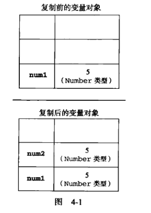
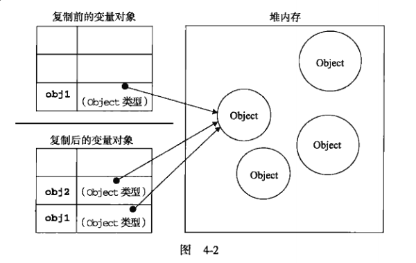

# 4.1基本类型和引用类型的值
 >`ECMAScript`变量可能包含两种不同数据类型的值：基本类型值和引用类型值。基本类型值指的是简单的数据段，而引用类型值指那些可能由多个值构成的对象。
 
 * 基本数据类型：`undefined`、`null`、`boolean`、`number`、`string`。这5种基本数据类型是按值访问的，因为可以操作保存在变量中的实际值。
 * 引用类型的值是保存在内存中的对象。不允许直接访问内存中的位置，也就是说不能直接操作对象的内存空间。在操作对象时，实际上是在操作对象的引用而不是实际的对象。为此，引用类型的值是按引用访问的。

## 4.1.1 动态的属性
>不能给基本类型的值添加属性，只能给引用类型值动态添加属性。

## 4.1.2 复制变量值
>从一个变量向另一个变量复制**基本类型的值**，会在变量对象上创建一个新值，然后把该值复制到新变量分配的位置上。

<pre><code>
   var num1 = 5;
   var num2 = num1;
</code></pre>
此后，这两个变量可以参与任何操作而不会互相影响。 
下图展示了复制基本类型值的过程: 

>从一个变量向另一个变量复制**引用类型的值**，同样也会将存储在变量对象中的值复制一份放到为新变量分配的空间中。不同的是，这个值的副本实际上是一个指针，而这个指针指向存储在堆中的一个对象。复制操作结束后，两个变量实际上将引用同一个对象。
 
 <pre><code>
     var obj1 = new Object();
     var obj2 = obj1;
     obj1.name = "Nicholas";
     alert(obj2.name);      //Nicholas
 </code></pre>
 改变其中一个变量，就会影响另一个变量。 
下图展示了复制引用类型值的过程: 

## 4.1.3 检测类型
>要检测一个*变量*的基本数据类型，`typeof`是最佳的工具。 
要检测引用类型的具体属于哪个类型，用`instanceof`操作符。如果变量是给定引用类型的实例，则返回true。

<pre><code>
    console.log(person instanceof Object);
    console.log(colors instanceof Array);
    console.log(pattern instanceof RegExp);
</code></pre>
如果使用`instanceof`操作符检测基本类型的值，则该操作符始终会返回`false`，因为基本类型不是对象。

# 4.2执行环境及作用域
> 执行环境的类型总共有两种——全局和局部（函数）。

<pre><code>
    var color = "blue";

    function changeColor(){
        var anotherColor = "red";

        function swapColors(){
            var tempColor = anotherColor;
            anotherColor = color;
            color = tempColor;
        }
    }
</code></pre>
以上代码共涉及3个执行环境：全局环境、changeColor()的局部环境和swapColors()的局部环境。 
全局环境中有一个变量color和一个函数changeColor()。 
对swapColors()而言，其作用域链中包含3个对象：swapColors()的变量对象、changeColor()的变量对象和全局变量对象。 
**内部环境可以通过作用域链访问所有的外部环境，但外部环境不能访问内部环境中的任何变量和函数。这些环境之间的联系是线性、有次序的。每个环境都可以向上搜索作用域链，以查询变量和函数名；但任何环境都不能通过向下搜索作用域链而进入另一个执行环境。** 

## 4.2.1 延长作用域链
>因为有些语句可以在作用域链的前端临时增加一个变量对象，该变量对象会在代码执行后被移除。在以下两种情况下会发生这种现象：

* `try-catch`语句的catch块；
* `with`语句。

`catch`语句会创建一个新的变量对象，其中包含的是被抛出的错误对象的声明。 
`with`语句会将指定的对象添加到作用域链中。
<pre><code>
    function buildUrl(){
        var qs = "?debug=true";
        with(location){
            var url = href + qs;
        }
        return url;
        /*能返回url，说明url是属于buildUrl()函数中的变量，而不是with中的变量。with是个语句块，不是函数块。*/
    }
</code></pre>

## 4.2.2 没有块级作用域
1. 变量声明
> 使用`var`声明的变量会自动被添加到最接近的环境中。在函数内部，最接近的环境就是函数的局部环境；在with语句中，最接近的环境是*函数环境*。如果初始化变量时没有使用`var`声明，该变量会自动被添加到全局环境。

**建议：**在初始化变量之前，一定要先声明。在严格模式下，初始化未经声明的变量会导致错误。

# 4.3 垃圾收集
> `JavaScript`具有自动垃圾收集机制，执行环境会负责管理代码执行过程中使用的内存。
> 垃圾收集机制的原理：找出那些不再继续使用的变量，然后释放其占用的内存。 
> 垃圾收集器跟踪哪个变量有用哪个变量没用，对于不再有用的变量打上标记，以备将来收回其占用的内存。标识无用变量的策略通常有以下两种：

* 标记清除
* 引用计数

## 4.3.1 标记清除
&emsp;&emsp;垃圾收集器在运行的时候会给存储在内存中的所有变量都加上标记。然后，它会去掉环境中的变量以及被环境中的变量引用的变量的标记。而在此之后再被加上标记的变量将会被视为准备删除的变量，原因是环境中的变量已经无法访问到这些变量了。最后，垃圾收集器完成内存清除工作，销毁那些带标记的值并回收它们所占用的内存空间。

## 4.3.2 引用计数
&emsp;&emsp;跟踪记录每个值被引用的次数。当声明了一个变量并将一个引用类型值赋给该变量时，则这个值得引用次数就是1。如果同一个值又被赋给另一个变量，则该值的引用次数加1.相反，如果包含对这个值引用的变量又取得了另外一个值，则这个值的引用次数减1.当这个值得引用次数变成0时，则说明没有办法再访问这个值了，因而就可以将其占用的内存空间回收回来。 
&emsp;&emsp;使用引用计数会有一个很严重的问题：循环引用。 
<pre><code>
    function problem(){
        var objectA = new Object();
        var objectB = new Object();
        objectA.someOtherObject = objectB;
        objectB.anotherObject = objectA;
    }
</code></pre>
在上面这个例子中，objectA和objectB通过各自的属性相互引用，这两个对象额引用次数都是2。在采用引用计数策略的实现中，当函数执行完毕后，objectA和objectB还将继续存在，因为它们的引用次数永远不会是0。

## 4.3.3 性能问题
垃圾收集器是周期性运行的，而且如果变量分配的内存数量很客观，那么回收工作量也是相当大的。在这种情况下，确定垃圾收集的时间间隔是一个非常重要的问题。 
在有的浏览器中可以出发垃圾收集过程，但建议不要这样做。

## 4.3.4 管理内存
确保占用最少的内存可以让页面获得更好的性能。而优化内存占用的最佳方式，就是为执行中的代码只保存必要的数据。一旦数据不再有用，最好通过将其值设置为`null`来释放引用——这个做法叫做**解除引用**。
<pre><code>
    function createPerson(name){
        var localPerson = new Object();
        localPerson.name = name;
        return localPerson;
    }
    var globalPerson = createPerson("Nicholas");
    //后面不再使用它的时候手工解除引用
    globalPerson = null;
</code></pre>
解除一个值的引用并不意味着自动回收该值所占用的内存。解除引用的真正作用是让值脱离执行环境，以便垃圾收集器下次运行时将其回收。

# 4.4 小结
&emsp;&emsp;`JavaScript`变量可以用来保存两种类型的值：基本类型和引用类型。它们具有以下特点：

* 基本类型值在内存中占据固定大小的空间，因此被保存在栈内存中；
* 引用类型的值是对象，保存在堆内存中；
* 确定一个值是哪种基本类型可以使用`typeof`操作符，而确定一个值是哪种引用类型可以使用`instanceof`操作符。

&emsp;&emsp;所有变量（包括基本类型和引用类型）都存在于一个执行环境（也称为作用域）当做，这个执行环境决定了变量的生命周期，以及哪一部分代码可以访问其中的变量。

* 每次进入一个新执行环境，都会创建一个用于搜索变量和函数的作用域链；
* 变量的执行环境有助于确定应该何时释放内存。

&emsp;&emsp;`JavaScript`是一门具有自动垃圾收集机制的编程语言，开发人员不必关心内存分配和回收问题。

* 离开作用域的值将被自动标记为可以回收，因此将在垃圾收集期间被删除；
* “标记清除”是目前主流的垃圾收集算法，这种算法的思想是给当前不使用的值加上标记，然后再回收其内存。
* 另一种垃圾收集算法是“引用计数”，这种算法的思想是跟踪记录所有值被引用的次数。`JavaScript`引擎目前都不使用这种算法；但在IE中访问非原生`JavaScript`对象（如DOM元素）时，这种算法仍然可能会导致问题。
* 当代码中存在循环引用时，“引用计数”算法就会导致问题。
* 解除变量的引用不仅有助有消除循环引用的现象，而且对垃圾收集也有好处。为了确保有效第回收内存，应该及时解除不再使用的全局对象、全局对象属性以及循环引用变量的引用。

